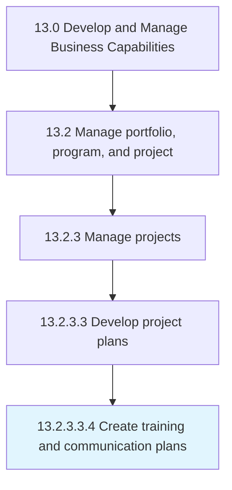
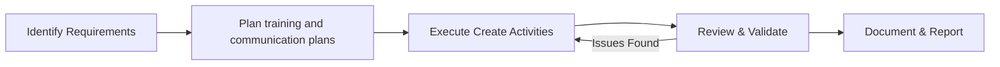

# Create training and communication plans

> Designing a plan for equipping the project team with the necessary skills and abilities to fulfill their roles and responsibilities in the project effectively and efficiently.

## Overview

The create training and communication plans process is a critical component of the Business Capabilities function within an organization. It encompasses the systematic approach to create training and communication plans, ensuring that all activities are performed consistently, efficiently, and in alignment with organizational objectives. This process establishes the framework through which create training and communication plans is executed, monitored, and continuously improved to deliver value across the enterprise.

Within the APQC Process Classification Framework (hierarchy 13.2.3.3.4), this subactivity supports the broader "Develop and Manage Business Capabilities" category. Effective execution requires cross-functional collaboration, clear accountability, and robust governance mechanisms. Organizations that mature this process typically see improved operational performance, reduced risk exposure, and stronger alignment between tactical activities and strategic goals.


## Process Hierarchy



## Key Statistics

| Metric | Value |
|--------|-------|
| APQC Code | 11125 |
| Hierarchy ID | 13.2.3.3.4 |
| Level | Sub-Activity |
| Parent | [13.2.3.3](../) |
| Sub-Processes | 0 |


## GraphDL Semantic Structure

```graphdl
create.TrainingAndCommunicationPlans
```

| Component | Value | Description |
|-----------|-------|-------------|
| Verb | `create` | Primary action |
| Object | `training and communication plans` | Direct object |


## Process Flow



## RACI Matrix

| Activity | Analyst | Manager | Specialist | Manager |
|----------|------|------|------|------|
| Planning & Scoping | R | A | C | I |
| Execution | A | C | I | R |
| Review & Approval | C | I | R | A |
| Reporting | I | R | A | C |

## Related Occupations

- [Business Process Analyst](/occupations/BusinessProcessAnalyst)
- [Quality Manager](/occupations/QualityManager)
- [Change Management Specialist](/occupations/ChangeManagementSpecialist)
- [Continuous Improvement Manager](/occupations/ContinuousImprovementManager)

## Related Departments

- Business Excellence
- Quality Assurance
- Organizational Development

## Industry Variations

### Manufacturing

Lean Six Sigma deployment, total quality management, production capability maturity, and operational excellence programs.

### Consulting

Knowledge management systems, methodology development, capability benchmarking, and best practice dissemination frameworks.

### Retail

Omnichannel capability development, customer experience optimization, supply chain agility improvements, and workforce capability building.

## KPIs & Metrics

| KPI | Target | Measurement Frequency |
|-----|--------|----------------------|
| Process Maturity Score | > Level 3 | Annually |
| Improvement Initiative ROI | > 150% | Per Initiative |
| Knowledge Asset Utilization | > 70% | Quarterly |
| Capability Gap Closure Rate | > 80% | Semi-Annually |

## Related Concepts

- TrainingPlans
- CommunicationPlans


---

*Source: APQC PCF 11125 (13.2.3.3.4) - APQC*
