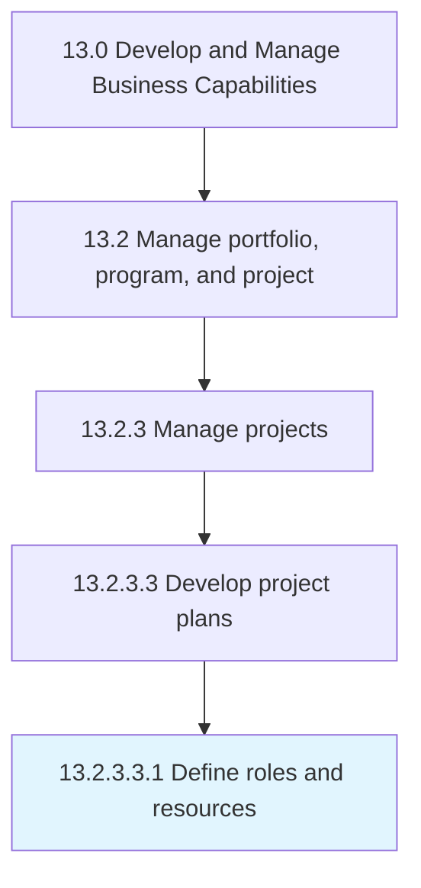

# Define roles and resources

> Outlining the resources and their roles in the business projects.

## Overview

Sub-Activity 13.2.3.3.1 is an activity within the Develop and Manage Business Capabilities framework. 

Outlining the resources and their roles in the business projects.

## Process Hierarchy



## Key Statistics

| Metric | Value |
|--------|-------|
| APQC Code | 11123 |
| Hierarchy ID | 13.2.3.3.1 |
| Level | Sub-Activity |
| Parent | [13.2.3.3](../) |
| Sub-Processes | 0 |


## GraphDL Semantic Structure

```
define.RolesAndResources
```

| Component | Value | Description |
|-----------|-------|-------------|
| Verb | `define` | Primary action |
| Object | `roles and resources` | Direct object |


## Related Concepts

- [Roles](/concepts/Roles)
- [Resources](/concepts/Resources)


---

*Source: APQC PCF 11123 (13.2.3.3.1) - APQC*
