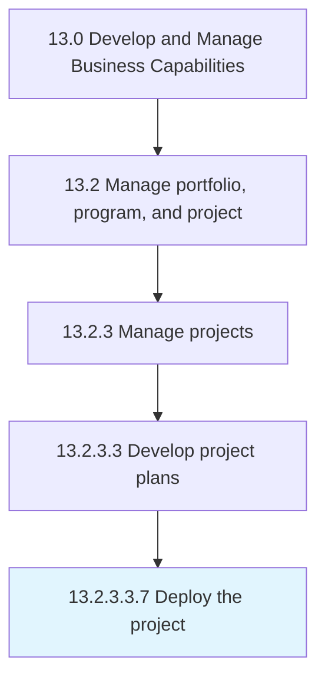

# Deploy the project

> Putting the project into position by effectively bringing it into action.

## Overview

Sub-Activity 13.2.3.3.7 is an activity within the Develop and Manage Business Capabilities framework. 

Putting the project into position by effectively bringing it into action.

## Process Hierarchy



## Key Statistics

| Metric | Value |
|--------|-------|
| APQC Code | 11129 |
| Hierarchy ID | 13.2.3.3.7 |
| Level | Sub-Activity |
| Parent | [13.2.3.3](../) |
| Sub-Processes | 0 |


## GraphDL Semantic Structure

```
deploy.TheProject
```

| Component | Value | Description |
|-----------|-------|-------------|
| Verb | `deploy` | Primary action |
| Object | `the project` | Direct object |


## Related Concepts

- Project


---

*Source: APQC PCF 11129 (13.2.3.3.7) - APQC*
