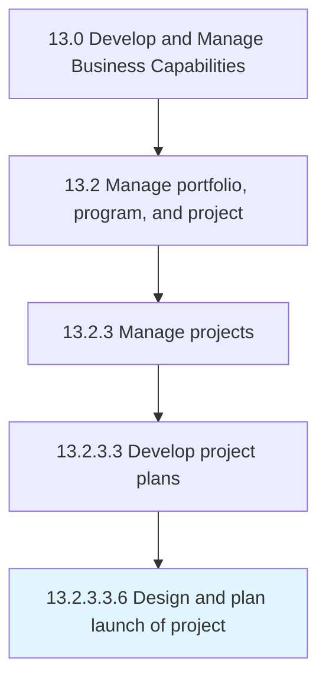

# Design and plan launch of project

> Creating a plan specifying when to initiate the project, and introducing it to the target audience.

## Overview

Sub-Activity 13.2.3.3.6 is an activity within the Develop and Manage Business Capabilities framework. 

Creating a plan specifying when to initiate the project, and introducing it to the target audience. Clearly define the project team, objectives, timelines, and milestone.

## Process Hierarchy



## Key Statistics

| Metric | Value |
|--------|-------|
| APQC Code | 11128 |
| Hierarchy ID | 13.2.3.3.6 |
| Level | Sub-Activity |
| Parent | [13.2.3.3](../) |
| Sub-Processes | 0 |


## GraphDL Semantic Structure

```
design.AndPlanLaunch.of.Project
```

| Component | Value | Description |
|-----------|-------|-------------|
| Verb | `design` | Primary action |
| Object | `and plan launch` | Direct object |
| Preposition | `of` | Relationship |
| PrepObject | `project` | Indirect object |


## Related Concepts

- Launch
- Project
- Launch
- Project


---

*Source: APQC PCF 11128 (13.2.3.3.6) - APQC*
