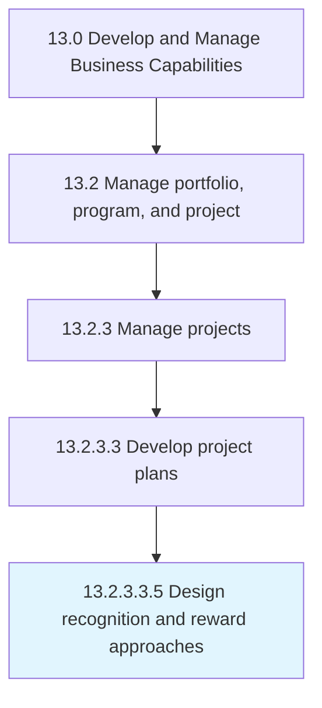

# Design recognition and reward approaches

> Creating a plan for recognizing and rewarding extraordinary performances within the business projects.

## Overview

Sub-Activity 13.2.3.3.5 is an activity within the Develop and Manage Business Capabilities framework. 

Creating a plan for recognizing and rewarding extraordinary performances within the business projects. Use incentives, bonuses, and certificates for recognition and rewarding purposes.

## Process Hierarchy



## Key Statistics

| Metric | Value |
|--------|-------|
| APQC Code | 11127 |
| Hierarchy ID | 13.2.3.3.5 |
| Level | Sub-Activity |
| Parent | [13.2.3.3](../) |
| Sub-Processes | 0 |


## GraphDL Semantic Structure

```
design.RecognitionAndRewardApproaches
```

| Component | Value | Description |
|-----------|-------|-------------|
| Verb | `design` | Primary action |
| Object | `recognition and reward approaches` | Direct object |


## Related Concepts

- [Recognition](/concepts/Recognition)
- [RewardApproaches](/concepts/RewardApproaches)


---

*Source: APQC PCF 11127 (13.2.3.3.5) - APQC*
