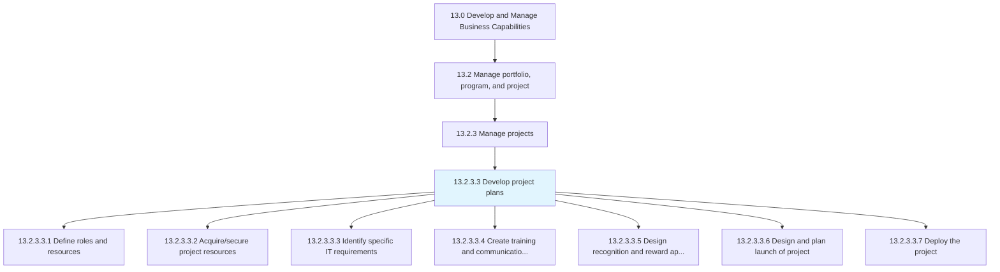
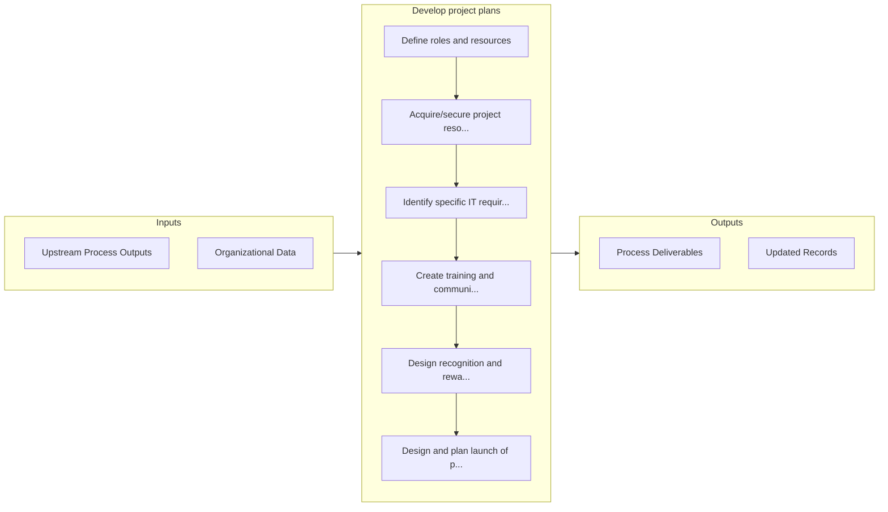

# Develop project plans

> Defining the resources and their roles.

## Overview

Activity 13.2.3.3 is an activity within the Develop and Manage Business Capabilities framework. 

Defining the resources and their roles. Identify IT requirements. Create plans for effective training and communication. Design reward approaches. Plan the launch of project. Deploy the project.

## Process Hierarchy



## Key Statistics

| Metric | Value |
|--------|-------|
| APQC Code | 16413 |
| Hierarchy ID | 13.2.3.3 |
| Level | Activity |
| Parent | [13.2.3](../) |
| Sub-Processes | 7 |


## GraphDL Semantic Structure

```
develop.ProjectPlans
```

| Component | Value | Description |
|-----------|-------|-------------|
| Verb | `develop` | Primary action |
| Object | `project plans` | Direct object |


## Process Flow



## Sub-Processes

| Process | Hierarchy ID | Description |
|---------|-------------|-------------|
| [Define roles and resources](./DefineRolesAndResources) | 13.2.3.3.1 | Outlining the resources and their roles in the business projects |
| [Acquire/secure project resources](./AcquiresecureProjectResources) | 13.2.3.3.2 | Procuring the necessary resources outlined in Define roles and resources [11123] |
| [Identify specific IT requirements](./IdentifySpecificITRequirements) | 13.2.3.3.3 | Determining the IT requirements for specific business projects |
| [Create training and communication plans](./CreateTrainingAndCommunicationPlans) | 13.2.3.3.4 | Designing a plan for equipping the project team with the necessary skills and abilities to fulfill t |
| [Design recognition and reward approaches](./DesignRecognitionAndRewardApproaches) | 13.2.3.3.5 | Creating a plan for recognizing and rewarding extraordinary performances within the business project |
| [Design and plan launch of project](./DesignAndPlanLaunchOfProject) | 13.2.3.3.6 | Creating a plan specifying when to initiate the project, and introducing it to the target audience |
| [Deploy the project](./DeployTheProject) | 13.2.3.3.7 | Putting the project into position by effectively bringing it into action |


## Related Concepts

- ProjectPlans


---

*Source: APQC PCF 16413 (13.2.3.3) - APQC*
