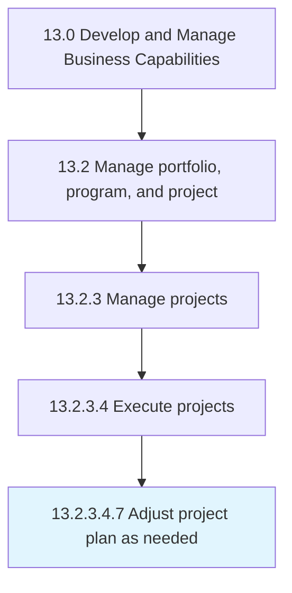

# Adjust project plan as needed

> Changes to project plans based upon internal and or external influences on the project.

## Overview

Sub-Activity 13.2.3.4.7 is an activity within the Develop and Manage Business Capabilities framework. 

Changes to project plans based upon internal and or external influences on the project. This would include the update to the project plan file, as well as the communication to the team.

## Process Hierarchy



## Key Statistics

| Metric | Value |
|--------|-------|
| APQC Code | 21456 |
| Hierarchy ID | 13.2.3.4.7 |
| Level | Sub-Activity |
| Parent | [13.2.3.4](../) |
| Sub-Processes | 0 |


## GraphDL Semantic Structure

```
adjust.ProjectPlanAsNeeded
```

| Component | Value | Description |
|-----------|-------|-------------|
| Verb | `adjust` | Primary action |
| Object | `project plan as needed` | Direct object |


## Related Concepts

- [ProjectPlanAsNeeded](/concepts/ProjectPlanAsNeeded)


---

*Source: APQC PCF 21456 (13.2.3.4.7) - APQC*
