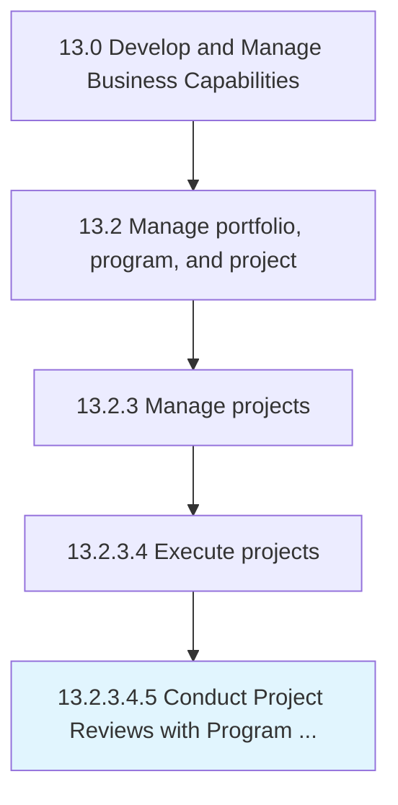

# Conduct Project Reviews with Program Managers and other stakeholders

> Hold post project reviews, lessons learned, or After Action Reviews (AARs) at the end of each project to understand what could be improved during future projects.

## Overview

Sub-Activity 13.2.3.4.5 is an activity within the Develop and Manage Business Capabilities framework. 

Hold post project reviews, lessons learned, or After Action Reviews (AARs) at the end of each project to understand what could be improved during future projects.

## Process Hierarchy



## Key Statistics

| Metric | Value |
|--------|-------|
| APQC Code | 21455 |
| Hierarchy ID | 13.2.3.4.5 |
| Level | Sub-Activity |
| Parent | [13.2.3.4](../) |
| Sub-Processes | 0 |


## GraphDL Semantic Structure

```
conduct.ProjectReviews.with.ProgramManagersAndOtherStakeholders
```

| Component | Value | Description |
|-----------|-------|-------------|
| Verb | `conduct` | Primary action |
| Object | `Project Reviews` | Direct object |
| Preposition | `with` | Relationship |
| PrepObject | `Program Managers and other stakeholders` | Indirect object |


## Related Concepts

- [ProjectReviews](/concepts/ProjectReviews)
- [ProgramManagersStakeholders](/concepts/ProgramManagersStakeholders)
- [ProjectReviews](/concepts/ProjectReviews)
- [OtherStakeholders](/concepts/OtherStakeholders)


---

*Source: APQC PCF 21455 (13.2.3.4.5) - APQC*
