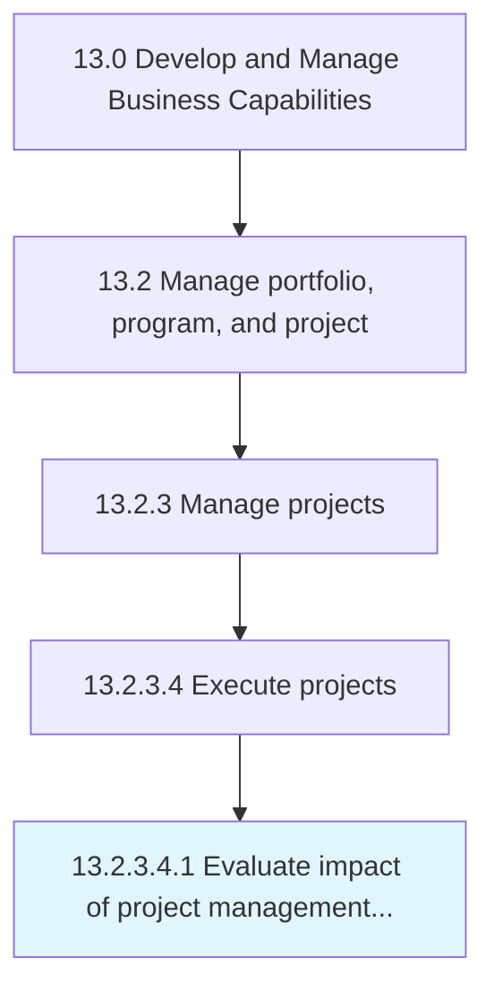

# Evaluate impact of project management (strategy and projects) on measures and outcomes

> Assessing the impact of business project management on the measures and outcomes of the projects.

## Overview

The evaluate impact of project management (strategy and projects) on measures and outcomes process is a critical component of the Business Capabilities function within an organization. It encompasses the systematic approach to evaluate impact of project management (strategy and projects) on measures and outcomes, ensuring that all activities are performed consistently, efficiently, and in alignment with organizational objectives. This process establishes the framework through which evaluate impact of project management (strategy and projects) on measures and outcomes is executed, monitored, and continuously improved to deliver value across the enterprise.

Within the APQC Process Classification Framework (hierarchy 13.2.3.4.1), this subactivity supports the broader "Develop and Manage Business Capabilities" category. Effective execution requires cross-functional collaboration, clear accountability, and robust governance mechanisms. Organizations that mature this process typically see improved operational performance, reduced risk exposure, and stronger alignment between tactical activities and strategic goals.


## Process Hierarchy


```mermaid
graph TD
    C13["13.0 Develop and Manage Business Capabilities"]
    C13 --> N13_2["13.2 Manage portfolio, program, and project"]
    N13_2 --> N13_2_3["13.2.3 Manage projects"]
    N13_2_3 --> N13_2_3_4["13.2.3.4 Execute projects"]
    N13_2_3_4 --> N13_2_3_4_1["13.2.3.4.1 Evaluate impact of project management..."]
    style N13_2_3_4_1 fill:#e1f5fe
```

## Key Statistics

| Metric | Value |
|--------|-------|
| APQC Code | 11131 |
| Hierarchy ID | 13.2.3.4.1 |
| Level | Sub-Activity |
| Parent | [13.2.3.4](../) |
| Sub-Processes | 0 |


## GraphDL Semantic Structure

```graphdl
evaluate.Impact.of.ProjectManagementStrategyAndProjectsOnMeasuresAndOutcomes
```

| Component | Value | Description |
|-----------|-------|-------------|
| Verb | `evaluate` | Primary action |
| Object | `impact` | Direct object |
| Preposition | `of` | Relationship |
| PrepObject | `project management (strategy and projects) on measures and outcomes` | Indirect object |


---

*Source: APQC PCF 11131 (13.2.3.4.1) - APQC*
