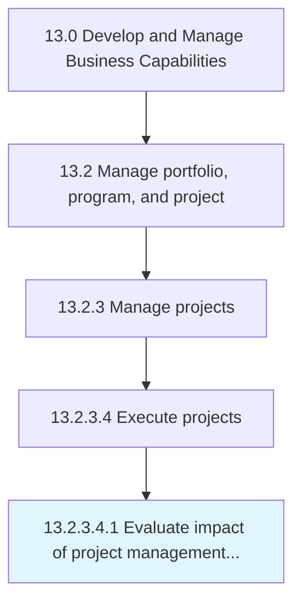

# Evaluate impact of project management (strategy and projects) on measures and outcomes

> Assessing the impact of business project management on the measures and outcomes of the projects.

## Overview

Sub-Activity 13.2.3.4.1 is an activity within the Develop and Manage Business Capabilities framework. 

Assessing the impact of business project management on the measures and outcomes of the projects. Gauge non-financial measures, frequency of measurement, action plan, etc.

## Process Hierarchy



## Key Statistics

| Metric | Value |
|--------|-------|
| APQC Code | 11131 |
| Hierarchy ID | 13.2.3.4.1 |
| Level | Sub-Activity |
| Parent | [13.2.3.4](../) |
| Sub-Processes | 0 |


## GraphDL Semantic Structure

```
evaluate.Impact.of.ProjectManagementStrategyAndProjectsOnMeasuresAndOutcomes
```

| Component | Value | Description |
|-----------|-------|-------------|
| Verb | `evaluate` | Primary action |
| Object | `impact` | Direct object |
| Preposition | `of` | Relationship |
| PrepObject | `project management (strategy and projects) on measures and outcomes` | Indirect object |


---

*Source: APQC PCF 11131 (13.2.3.4.1) - APQC*
