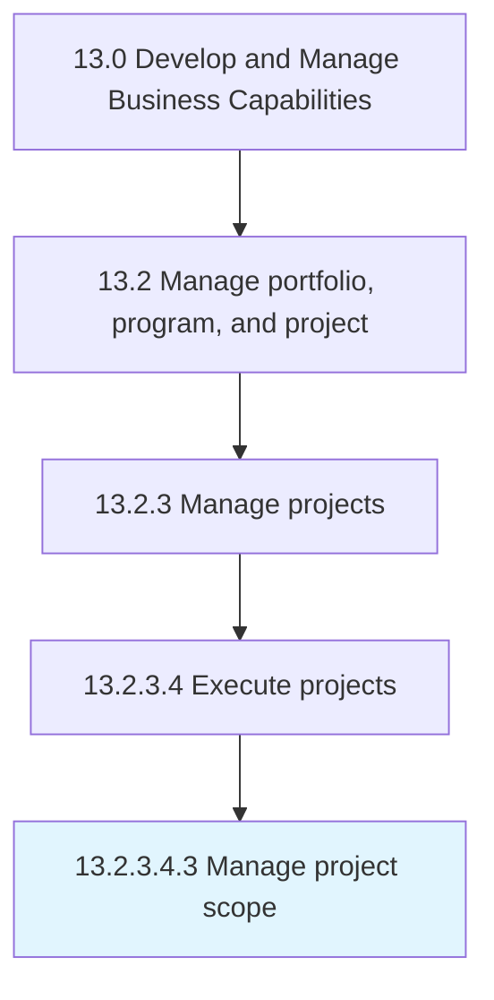

# Manage project scope

> Determining and documenting a list of specific project goals, deliverables, tasks, costs, and deadlines.

## Overview

Sub-Activity 13.2.3.4.3 is an activity within the Develop and Manage Business Capabilities framework. 

Determining and documenting a list of specific project goals, deliverables, tasks, costs, and deadlines. Use the scope statement to explain the boundaries of the project. Assign responsibilities for team members. Set up procedures for verifying and approving the completed tasks.

## Process Hierarchy



## Key Statistics

| Metric | Value |
|--------|-------|
| APQC Code | 16416 |
| Hierarchy ID | 13.2.3.4.3 |
| Level | Sub-Activity |
| Parent | [13.2.3.4](../) |
| Sub-Processes | 0 |


## GraphDL Semantic Structure

```
manage.ProjectScope
```

| Component | Value | Description |
|-----------|-------|-------------|
| Verb | `manage` | Primary action |
| Object | `project scope` | Direct object |


## Related Concepts

- [ProjectScope](/concepts/ProjectScope)


---

*Source: APQC PCF 16416 (13.2.3.4.3) - APQC*
