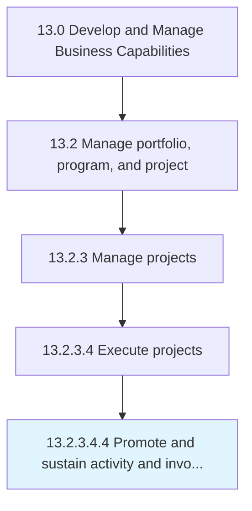

# Promote and sustain activity and involvement

> Encouraging and sustaining the activities and involvement while executing projects.

## Overview

Sub-Activity 13.2.3.4.4 is an activity within the Develop and Manage Business Capabilities framework. 

Encouraging and sustaining the activities and involvement while executing projects. Promote the execution activities of the projects. Encourage employee involvement in project implementation.

## Process Hierarchy



## Key Statistics

| Metric | Value |
|--------|-------|
| APQC Code | 11132 |
| Hierarchy ID | 13.2.3.4.4 |
| Level | Sub-Activity |
| Parent | [13.2.3.4](../) |
| Sub-Processes | 0 |


## GraphDL Semantic Structure

```
promote.AndSustainActivityAndInvolvement
```

| Component | Value | Description |
|-----------|-------|-------------|
| Verb | `promote` | Primary action |
| Object | `and sustain activity and involvement` | Direct object |


## Related Concepts

- Activity
- Involvement
- Activity
- Involvement


---

*Source: APQC PCF 11132 (13.2.3.4.4) - APQC*
