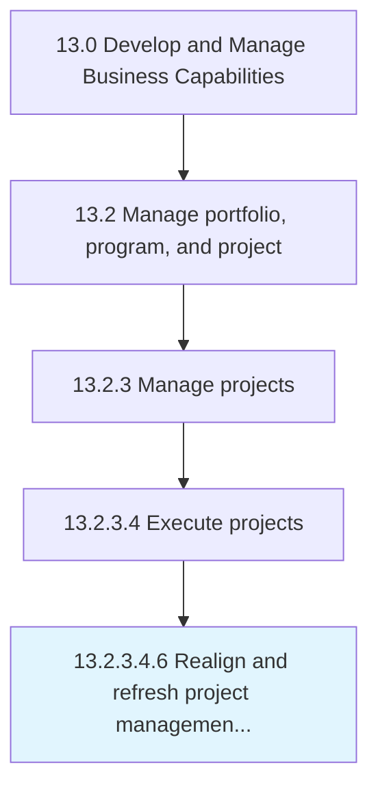

# Realign and refresh project management strategy and approaches

> Reorganizing and stimulating the approach and strategy for managing business projects.

## Overview

Sub-Activity 13.2.3.4.6 is an activity within the Develop and Manage Business Capabilities framework. 

Reorganizing and stimulating the approach and strategy for managing business projects. Make improvements based on the project scope and on findings from Evaluate the impact of project management (strategy and projects) on measures and outcomes [11131].

## Process Hierarchy



## Key Statistics

| Metric | Value |
|--------|-------|
| APQC Code | 11133 |
| Hierarchy ID | 13.2.3.4.6 |
| Level | Sub-Activity |
| Parent | [13.2.3.4](../) |
| Sub-Processes | 0 |


## GraphDL Semantic Structure

```
realign.AndRefreshProjectManagementStrategyAndApproaches
```

| Component | Value | Description |
|-----------|-------|-------------|
| Verb | `realign` | Primary action |
| Object | `and refresh project management strategy and approaches` | Direct object |


## Related Concepts

- RefreshProjectManagementStrategy
- Approaches


---

*Source: APQC PCF 11133 (13.2.3.4.6) - APQC*
