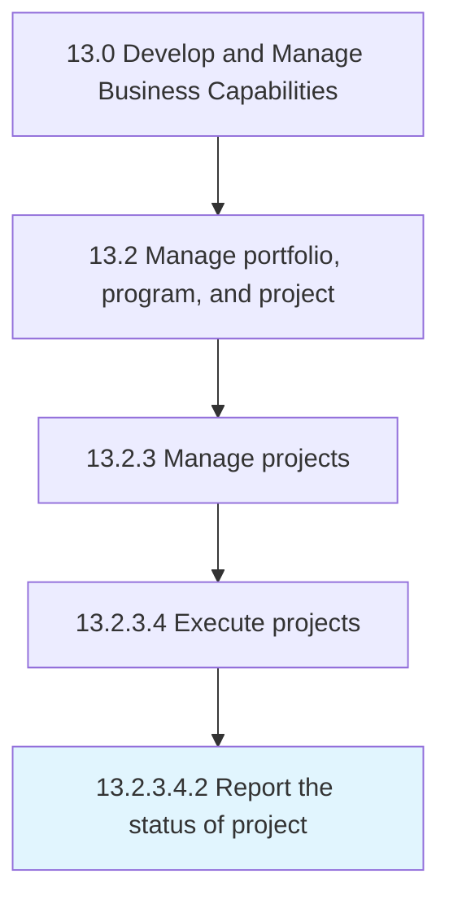

# Report the status of project

> Recording and documenting the current status and position of the project.

## Overview

Sub-Activity 13.2.3.4.2 is an activity within the Develop and Manage Business Capabilities framework. 

Recording and documenting the current status and position of the project. Record and report items such as completed tasks, incomplete tasks, planned tasks, and problems faced.

## Process Hierarchy



## Key Statistics

| Metric | Value |
|--------|-------|
| APQC Code | 16415 |
| Hierarchy ID | 13.2.3.4.2 |
| Level | Sub-Activity |
| Parent | [13.2.3.4](../) |
| Sub-Processes | 0 |


## GraphDL Semantic Structure

```
report.TheStatus.of.Project
```

| Component | Value | Description |
|-----------|-------|-------------|
| Verb | `report` | Primary action |
| Object | `the status` | Direct object |
| Preposition | `of` | Relationship |
| PrepObject | `project` | Indirect object |


## Related Concepts

- Status
- Project


---

*Source: APQC PCF 16415 (13.2.3.4.2) - APQC*
