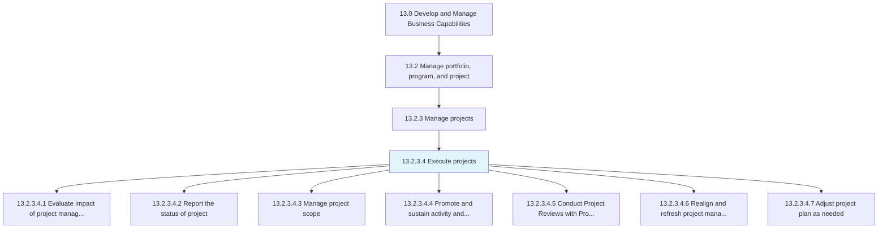
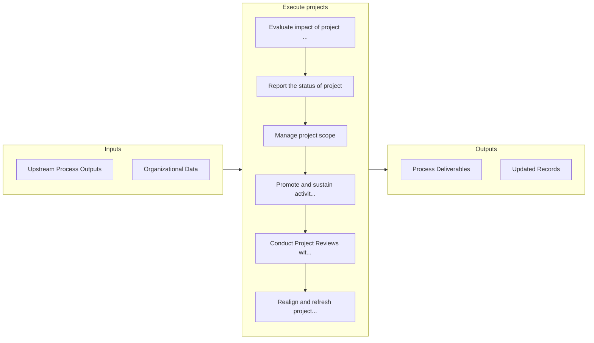

# Execute projects

> Implementing the business projects of the organization.

## Overview

Activity 13.2.3.4 is an activity within the Develop and Manage Business Capabilities framework. 

Implementing the business projects of the organization. Evaluate the impact of project management. Record and report the status of the project. Manage the project scope. Promote and sustain activities and involvement. Realign and revamp the project management strategy and approach.

## Process Hierarchy



## Key Statistics

| Metric | Value |
|--------|-------|
| APQC Code | 16414 |
| Hierarchy ID | 13.2.3.4 |
| Level | Activity |
| Parent | [13.2.3](../) |
| Sub-Processes | 7 |


## GraphDL Semantic Structure

```graphdl
execute.Projects
```

| Component | Value | Description |
|-----------|-------|-------------|
| Verb | `execute` | Primary action |
| Object | `projects` | Direct object |


## Process Flow



## Sub-Processes

| Process | Hierarchy ID | Description |
|---------|-------------|-------------|
| [Evaluate impact of project management (strategy and projects) on measures and outcomes](./EvaluateImpactOfProjectManagementStrategyAndProjectsOnMeasuresAndOutcomes) | 13.2.3.4.1 | Assessing the impact of business project management on the measures and outcomes of the projects |
| [Report the status of project](./ReportTheStatusOfProject) | 13.2.3.4.2 | Recording and documenting the current status and position of the project |
| [Manage project scope](./ManageProjectScope) | 13.2.3.4.3 | Determining and documenting a list of specific project goals, deliverables, tasks, costs, and deadli |
| [Promote and sustain activity and involvement](./PromoteAndSustainActivityAndInvolvement) | 13.2.3.4.4 | Encouraging and sustaining the activities and involvement while executing projects |
| [Conduct Project Reviews with Program Managers and other stakeholders](./ConductProjectReviewsWithProgramManagersAndOtherStakeholders) | 13.2.3.4.5 | Hold post project reviews, lessons learned, or After Action Reviews (AARs) at the end of each projec |
| [Realign and refresh project management strategy and approaches](./RealignAndRefreshProjectManagementStrategyAndApproaches) | 13.2.3.4.6 | Reorganizing and stimulating the approach and strategy for managing business projects |
| [Adjust project plan as needed](./AdjustProjectPlanAsNeeded) | 13.2.3.4.7 | Changes to project plans based upon internal and or external influences on the project |


## Related Concepts

- Projects


---

*Source: APQC PCF 16414 (13.2.3.4) - APQC*
