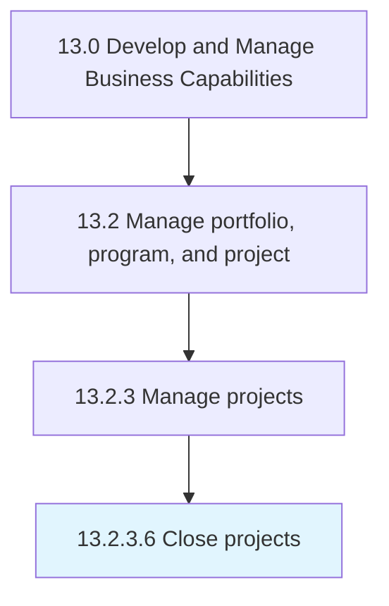

# Close projects

> Settling each contract.

## Overview

Activity 13.2.3.6 is an activity within the Develop and Manage Business Capabilities framework. 

Settling each contract. Close each contract applicable to the project or project phase. Finalize all activities across all of the process groups in order to formally close the project or a project phase.

## Process Hierarchy



## Key Statistics

| Metric | Value |
|--------|-------|
| APQC Code | 16418 |
| Hierarchy ID | 13.2.3.6 |
| Level | Activity |
| Parent | [13.2.3](../) |
| Sub-Processes | 0 |


## GraphDL Semantic Structure

```
close.Projects
```

| Component | Value | Description |
|-----------|-------|-------------|
| Verb | `close` | Primary action |
| Object | `projects` | Direct object |


## Related Concepts

- Projects


---

*Source: APQC PCF 16418 (13.2.3.6) - APQC*
