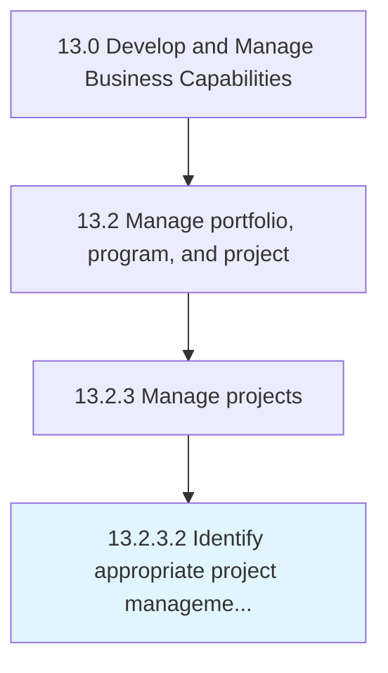

# Identify appropriate project management methodologies

> Identifying and implementing the techniques and procedures for managing business projects.

## Overview

Activity 13.2.3.2 is an activity within the Develop and Manage Business Capabilities framework. 

Identifying and implementing the techniques and procedures for managing business projects. Identify the most appropriate models, which are to be employed by the project managers for the purpose of designing, planning, implementing, and achieving project objectives. Examine and assess various project management methodologies such as adaptive project framework, agile development, crystal methods, and feature-driven development.

## Process Hierarchy



## Key Statistics

| Metric | Value |
|--------|-------|
| APQC Code | 11119 |
| Hierarchy ID | 13.2.3.2 |
| Level | Activity |
| Parent | [13.2.3](../) |
| Sub-Processes | 0 |


## GraphDL Semantic Structure

```
identify.AppropriateProjectManagementMethodologies
```

| Component | Value | Description |
|-----------|-------|-------------|
| Verb | `identify` | Primary action |
| Object | `appropriate project management methodologies` | Direct object |


## Related Concepts

- AppropriateProjectManagementMethodologies


---

*Source: APQC PCF 11119 (13.2.3.2) - APQC*
