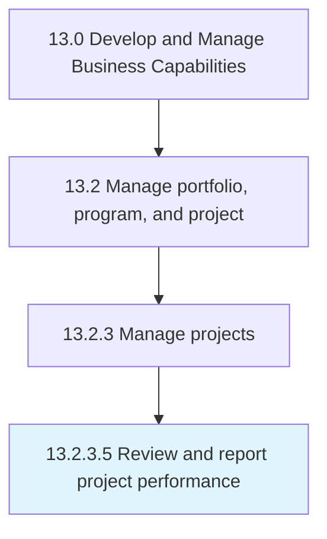

# Review and report project performance

> Measuring the performance of a business project against key performance indicators including the project scope, schedule, quality, cost, and risk criteria.

## Overview

Activity 13.2.3.5 is an activity within the Develop and Manage Business Capabilities framework. 

Measuring the performance of a business project against key performance indicators including the project scope, schedule, quality, cost, and risk criteria. Identify any deviations from the plan. Assess the impact of these deviations on the project, as well as on the overall program. Report results to key stakeholders.

## Process Hierarchy



## Key Statistics

| Metric | Value |
|--------|-------|
| APQC Code | 16417 |
| Hierarchy ID | 13.2.3.5 |
| Level | Activity |
| Parent | [13.2.3](../) |
| Sub-Processes | 0 |


## GraphDL Semantic Structure

```
review.AndReportProjectPerformance
```

| Component | Value | Description |
|-----------|-------|-------------|
| Verb | `review` | Primary action |
| Object | `and report project performance` | Direct object |


## Related Concepts

- [ProjectPerformance](/concepts/ProjectPerformance)
- [ProjectPerformance](/concepts/ProjectPerformance)


---

*Source: APQC PCF 16417 (13.2.3.5) - APQC*
