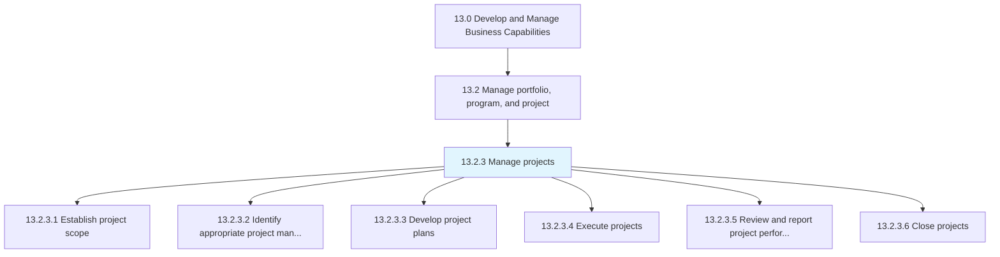
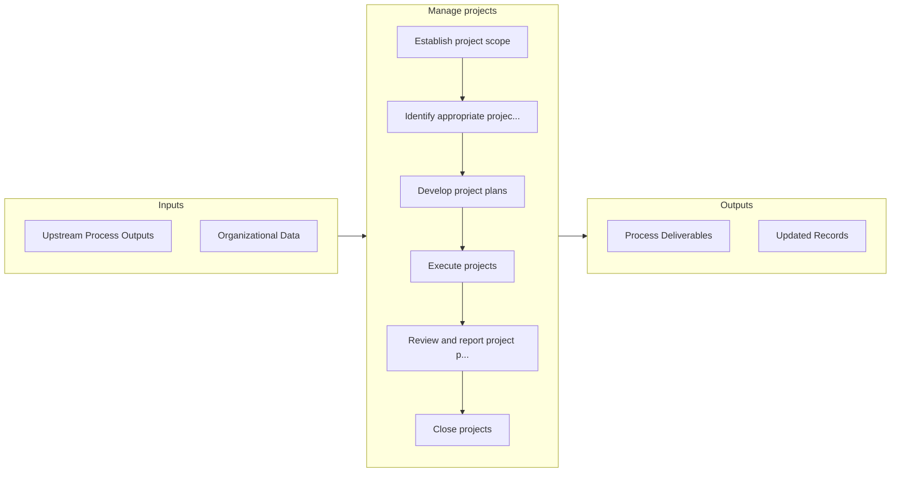

# Manage projects

> Establishing the scope of the projects.

## Overview

Process 13.2.3 is a core process that defines the specific procedures for manage projects. 

Establishing the scope of the projects. Create plans for implementing the projects. Initiate projects. Review and report project performance to management. Close projects.

## Process Hierarchy



## Key Statistics

| Metric | Value |
|--------|-------|
| APQC Code | 16410 |
| Hierarchy ID | 13.2.3 |
| Level | Process |
| Parent | [13.2](../) |
| Sub-Processes | 6 |


## GraphDL Semantic Structure

```
manage.Projects
```

| Component | Value | Description |
|-----------|-------|-------------|
| Verb | `manage` | Primary action |
| Object | `projects` | Direct object |


## Process Flow



## Sub-Processes

| Process | Hierarchy ID | Description |
|---------|-------------|-------------|
| [Establish project scope](./13.2.3.1-EstablishProjectScope/) | 13.2.3.1 | Establishing the horizons of business projects |
| [Identify appropriate project management methodologies](./IdentifyAppropriateProjectManagementMethodologies) | 13.2.3.2 | Identifying and implementing the techniques and procedures for managing business projects |
| [Develop project plans](./13.2.3.3-DevelopProjectPlans/) | 13.2.3.3 | Defining the resources and their roles |
| [Execute projects](./13.2.3.4-ExecuteProjects/) | 13.2.3.4 | Implementing the business projects of the organization |
| [Review and report project performance](./ReviewAndReportProjectPerformance) | 13.2.3.5 | Measuring the performance of a business project against key performance indicators including the pro |
| [Close projects](./CloseProjects) | 13.2.3.6 | Settling each contract |


## Related Concepts

- Projects


---

*Source: APQC PCF 16410 (13.2.3) - APQC*
