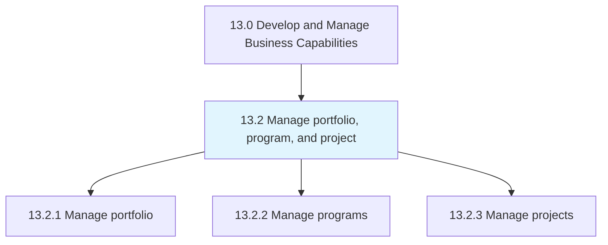
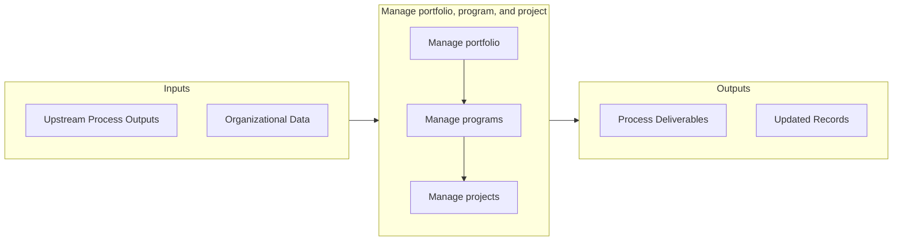

# Manage portfolio, program, and project

> Managing investments, holdings, products, businesses, and brands, along with the related projects that together constitute a program.

## Overview

Group 13.2 is a process group within APQC Category 13.0 (Develop and Manage Business Capabilities). 

Managing investments, holdings, products, businesses, and brands, along with the related projects that together constitute a program.

## Process Hierarchy



## Key Statistics

| Metric | Value |
|--------|-------|
| APQC Code | 16400 |
| Hierarchy ID | 13.2 |
| Level | Group |
| Parent | [13](../) |
| Sub-Processes | 3 |


## GraphDL Semantic Structure

```
manage.PortfolioProgramAndProject
```

| Component | Value | Description |
|-----------|-------|-------------|
| Verb | `manage` | Primary action |
| Object | `portfolio, program, and project` | Direct object |


## Process Flow



## Sub-Processes

| Process | Hierarchy ID | Description |
|---------|-------------|-------------|
| [Manage portfolio](./13.2.1-ManagePortfolio/) | 13.2.1 | Managing the business portfolio of the organization, including investments, holdings, products, busi |
| [Manage programs](./13.2.2-ManagePrograms/) | 13.2.2 | Establishing, implementing, and managing business programs |
| [Manage projects](./13.2.3-ManageProjects/) | 13.2.3 | Establishing the scope of the projects |


## Related Concepts

- Portfolio
- Program
- Project


---

*Source: APQC PCF 16400 (13.2) - APQC*
