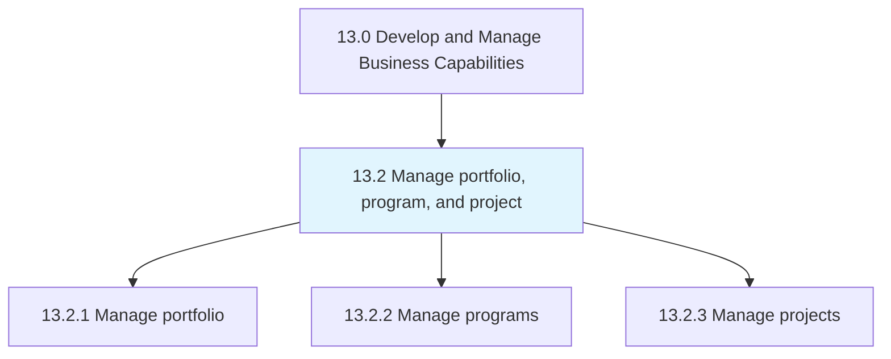
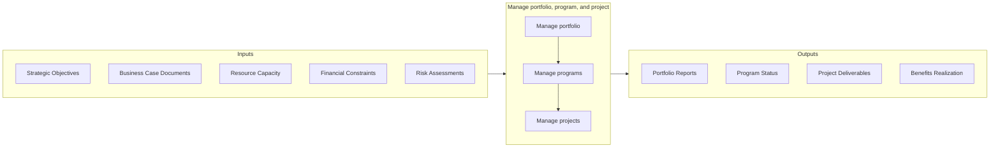
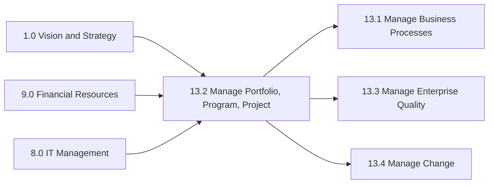

# Manage portfolio, program, and project

> Managing investments, holdings, products, businesses, and brands, along with the related projects that together constitute a program.

## Overview

Group 13.2 is a process group within APQC Category 13.0 (Develop and Manage Business Capabilities) that establishes the organizational capability to strategically manage portfolios, coordinate programs, and execute projects effectively. This process group represents a critical competency for translating strategic objectives into tangible business outcomes through structured initiative management.

Portfolio management focuses on selecting and prioritizing the right mix of programs and projects to maximize organizational value. Program management coordinates groups of related projects to achieve benefits that would not be possible if managed individually. Project management ensures that individual initiatives are executed efficiently within defined constraints of scope, time, cost, and quality.

Together, these three levels of management create a hierarchical governance structure that aligns tactical execution with strategic intent, enabling organizations to optimize resource allocation, manage risk across initiatives, and deliver measurable business value.

## Process Hierarchy



## Key Statistics

| Metric | Value |
|--------|-------|
| APQC Code | 16400 |
| Hierarchy ID | 13.2 |
| Level | Group |
| Parent | [13](../) |
| Sub-Processes | 3 |


## GraphDL Semantic Structure

```graphdl
manage.PortfolioProgramAndProject
```

| Component | Value | Description |
|-----------|-------|-------------|
| Verb | `manage` | Primary action |
| Object | `portfolio, program, and project` | Direct object |


## Process Flow



## Child Processes

### 13.2.1 Manage Portfolio

Managing the business portfolio of the organization, including investments, holdings, products, businesses, and brands. This process establishes the strategic framework for evaluating, selecting, and prioritizing initiatives based on their alignment with organizational objectives and expected value contribution.

**Key Activities:**
- Establish portfolio strategy aligned with business objectives
- Define portfolio governance and decision-making authority
- Monitor and control portfolio performance and health
- Balance portfolio risk and return across investments
- Optimize resource allocation across initiatives

[View Process Details](./13.2.1-ManagePortfolio/)

### 13.2.2 Manage Programs

Establishing, implementing, and managing business programs that coordinate multiple related projects to deliver strategic benefits. Program management focuses on achieving outcomes that would not be possible through individual project management alone.

**Key Activities:**
- Define program scope and strategic objectives
- Establish program governance and stakeholder management
- Coordinate interdependencies across component projects
- Manage program-level risks and issues
- Realize and sustain program benefits

[View Process Details](./13.2.2-ManagePrograms/)

### 13.2.3 Manage Projects

Establishing the scope of projects and executing them according to defined methodologies. Project management ensures that individual initiatives deliver their intended outputs within constraints of time, cost, scope, and quality.

**Key Activities:**
- Initiate and plan project scope, schedule, and budget
- Execute project work and manage project team
- Monitor and control project performance
- Manage project risks, issues, and changes
- Close projects and capture lessons learned

[View Process Details](./13.2.3-ManageProjects/)


## RACI Matrix

| Activity | Responsible | Accountable | Consulted | Informed |
|----------|-------------|-------------|-----------|----------|
| Define portfolio strategy | Portfolio Manager | Chief Strategy Officer | Business Unit Heads | Finance, HR |
| Evaluate and prioritize initiatives | Portfolio Analyst | Portfolio Manager | Project Sponsors | All stakeholders |
| Allocate resources across portfolio | Resource Manager | COO | Portfolio Manager | Project Managers |
| Establish program governance | Program Manager | Program Sponsor | PMO Director | Executive team |
| Coordinate program components | Program Manager | Program Director | Project Managers | Stakeholders |
| Execute project work | Project Team | Project Manager | Program Manager | Sponsors |
| Monitor project performance | Project Manager | PMO Director | Stakeholders | Executive team |
| Report portfolio status | Portfolio Analyst | Portfolio Manager | CFO | Board of Directors |


## Metrics and KPIs

| Metric | Description | Target |
|--------|-------------|--------|
| Portfolio Value Index | Total expected value of portfolio investments | Growth >10% YoY |
| Strategic Alignment Score | Percentage of initiatives aligned with strategy | >95% |
| Resource Utilization Rate | Efficiency of resource allocation across portfolio | 80-90% |
| Program Benefits Realization | Actual vs. planned benefits achieved | >90% |
| Project Success Rate | Percentage of projects delivered on time/budget | >85% |
| Portfolio Risk Index | Aggregate risk exposure across all initiatives | Within tolerance |
| Time to Value | Average time from approval to benefit realization | <18 months |
| Initiative Throughput | Number of initiatives completed per period | Per capacity |


## Related Departments

- [Executive Office](/departments/Executive) - Strategic direction and portfolio approval
- [Strategy & Planning](/departments/Strategy) - Strategic alignment and prioritization
- [Project Management Office (PMO)](/departments/PMO) - Methodology and governance
- [Finance](/departments/Finance) - Budgeting and financial oversight
- [Human Resources](/departments/HR) - Resource planning and capability development
- [Information Technology](/departments/IT) - Technology initiatives and digital programs


## Related Occupations

- [General and Operations Managers](/occupations/Management/GeneralManagers) - Program sponsorship and executive oversight
- [Management Analysts](/occupations/Business/ManagementAnalysts) - Portfolio analysis and optimization
- [Project Management Specialists](/occupations/Business/ProjectManagers) - Project planning and execution
- [Financial Analysts](/occupations/Finance/FinancialAnalysts) - Investment analysis and ROI calculation
- [Computer and Information Systems Managers](/occupations/Technology/ITManagers) - Technology program leadership


## Industry Variations

### Financial Services

Financial institutions emphasize regulatory compliance in project governance, with enhanced documentation and approval processes. Portfolio management integrates with risk management frameworks (Basel III/IV) and requires robust audit trails.

### Healthcare

Healthcare organizations focus on patient safety and clinical outcome improvements. Programs often require clinical validation phases and must comply with HIPAA and other healthcare regulations. Change management is critical given clinical workflow impacts.

### Technology

Technology companies typically employ agile and hybrid methodologies with faster iteration cycles. Portfolio management emphasizes innovation metrics and time-to-market. Program management coordinates product releases across multiple development teams.

### Manufacturing

Manufacturing emphasizes capital project management with rigorous cost control and asset lifecycle considerations. Programs often span multiple facilities with complex supply chain dependencies.


## Related Processes



---

*Source: APQC PCF 16400 (13.2) - APQC*
