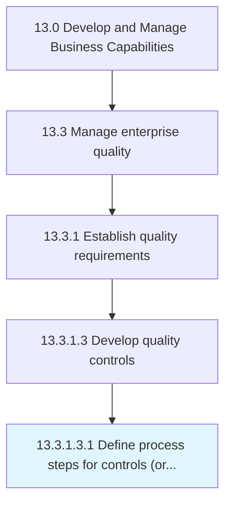

# Define process steps for controls (or integration points)

> Establishing the steps for developing quality controls.

## Overview

Sub-Activity 13.3.1.3.1 is an activity within the Develop and Manage Business Capabilities framework. 

Establishing the steps for developing quality controls. Conduct Alpha testing. Have the product team conduct rework. Send the product/service for Beta testing, and carry on rework as needed.

## Process Hierarchy



## Key Statistics

| Metric | Value |
|--------|-------|
| APQC Code | 17476 |
| Hierarchy ID | 13.3.1.3.1 |
| Level | Sub-Activity |
| Parent | [13.3.1.3](../) |
| Sub-Processes | 0 |


## GraphDL Semantic Structure

```
define.ProcessSteps.for.ControlsOrIntegrationPoints
```

| Component | Value | Description |
|-----------|-------|-------------|
| Verb | `define` | Primary action |
| Object | `process steps` | Direct object |
| Preposition | `for` | Relationship |
| PrepObject | `controls (or integration points)` | Indirect object |


---

*Source: APQC PCF 17476 (13.3.1.3.1) - APQC*
