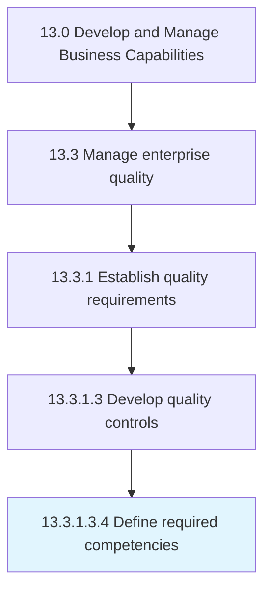

# Define required competencies

> Defining the competencies required for developing quality controls.

## Overview

Sub-Activity 13.3.1.3.4 is an activity within the Develop and Manage Business Capabilities framework. 

Defining the competencies required for developing quality controls. Define the required competencies including compliance management, audit management, and document control and document management.

## Process Hierarchy



## Key Statistics

| Metric | Value |
|--------|-------|
| APQC Code | 17479 |
| Hierarchy ID | 13.3.1.3.4 |
| Level | Sub-Activity |
| Parent | [13.3.1.3](../) |
| Sub-Processes | 0 |


## GraphDL Semantic Structure

```
define.RequiredCompetencies
```

| Component | Value | Description |
|-----------|-------|-------------|
| Verb | `define` | Primary action |
| Object | `required competencies` | Direct object |


## Related Concepts

- RequiredCompetencies


---

*Source: APQC PCF 17479 (13.3.1.3.4) - APQC*
