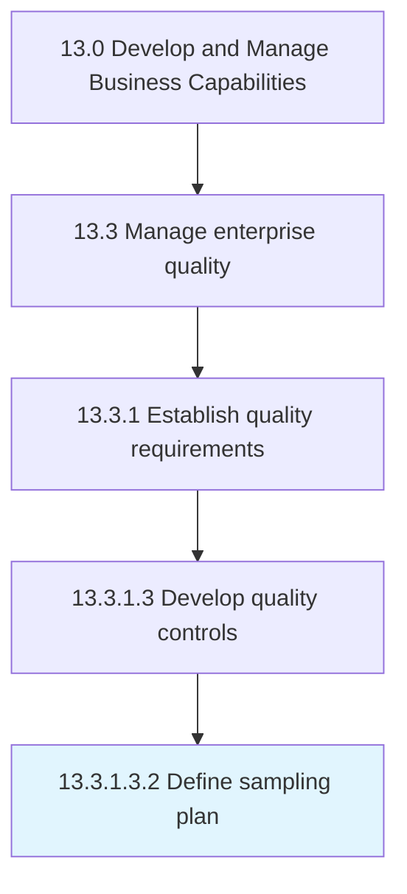

# Define sampling plan

> Establishing a detailed summary including measures, on which material, in what manner, and by whom.

## Overview

Sub-Activity 13.3.1.3.2 is an activity within the Develop and Manage Business Capabilities framework. 

Establishing a detailed summary including measures, on which material, in what manner, and by whom. Identify the parameters to be measured, the range of possible values, and the required resolution. Provide a sampling scheme that details how and when samples will be taken. Select sample sizes. Assign roles and responsibilities.

## Process Hierarchy



## Key Statistics

| Metric | Value |
|--------|-------|
| APQC Code | 17477 |
| Hierarchy ID | 13.3.1.3.2 |
| Level | Sub-Activity |
| Parent | [13.3.1.3](../) |
| Sub-Processes | 0 |


## GraphDL Semantic Structure

```
define.SamplingPlan
```

| Component | Value | Description |
|-----------|-------|-------------|
| Verb | `define` | Primary action |
| Object | `sampling plan` | Direct object |


## Related Concepts

- SamplingPlan


---

*Source: APQC PCF 17477 (13.3.1.3.2) - APQC*
