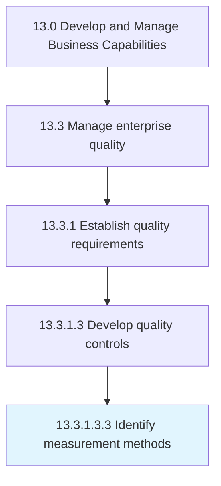

# Identify measurement methods

> Using tools to measure quality.

## Overview

Sub-Activity 13.3.1.3.3 is an activity within the Develop and Manage Business Capabilities framework. 

Using tools to measure quality. Use tools such as quality improvement oversight system tool, performance measurement tools, consumer information models/guides, and validation tools to effectively determine the quality levels.

## Process Hierarchy



## Key Statistics

| Metric | Value |
|--------|-------|
| APQC Code | 17478 |
| Hierarchy ID | 13.3.1.3.3 |
| Level | Sub-Activity |
| Parent | [13.3.1.3](../) |
| Sub-Processes | 0 |


## GraphDL Semantic Structure

```
identify.MeasurementMethods
```

| Component | Value | Description |
|-----------|-------|-------------|
| Verb | `identify` | Primary action |
| Object | `measurement methods` | Direct object |


## Related Concepts

- MeasurementMethods


---

*Source: APQC PCF 17478 (13.3.1.3.3) - APQC*
