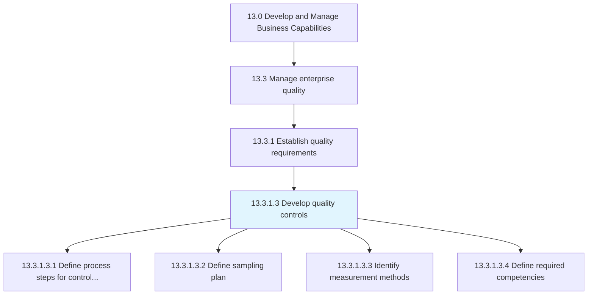
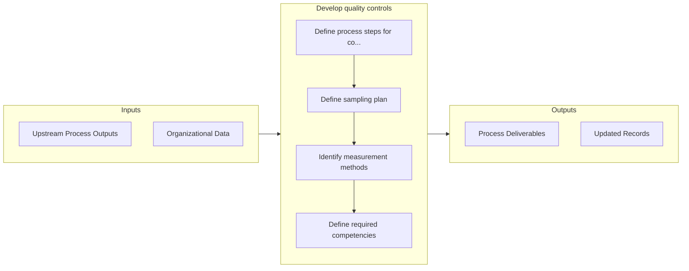

# Develop quality controls

> Developing controls for managing the quality of enterprise.

## Overview

Activity 13.3.1.3 is an activity within the Develop and Manage Business Capabilities framework. 

Developing controls for managing the quality of enterprise. Define the process steps for quality controls and the sampling plan. Identify the tools and methods to measure quality. Define the competencies required.

## Process Hierarchy



## Key Statistics

| Metric | Value |
|--------|-------|
| APQC Code | 17475 |
| Hierarchy ID | 13.3.1.3 |
| Level | Activity |
| Parent | [13.3.1](../) |
| Sub-Processes | 4 |


## GraphDL Semantic Structure

```
develop.QualityControls
```

| Component | Value | Description |
|-----------|-------|-------------|
| Verb | `develop` | Primary action |
| Object | `quality controls` | Direct object |


## Process Flow



## Sub-Processes

| Process | Hierarchy ID | Description |
|---------|-------------|-------------|
| [Define process steps for controls (or integration points)](./DefineProcessStepsForControlsOrIntegrationPoints) | 13.3.1.3.1 | Establishing the steps for developing quality controls |
| [Define sampling plan](./DefineSamplingPlan) | 13.3.1.3.2 | Establishing a detailed summary including measures, on which material, in what manner, and by whom |
| [Identify measurement methods](./IdentifyMeasurementMethods) | 13.3.1.3.3 | Using tools to measure quality |
| [Define required competencies](./DefineRequiredCompetencies) | 13.3.1.3.4 | Defining the competencies required for developing quality controls |


## Related Concepts

- [QualityControls](/concepts/QualityControls)


---

*Source: APQC PCF 17475 (13.3.1.3) - APQC*
