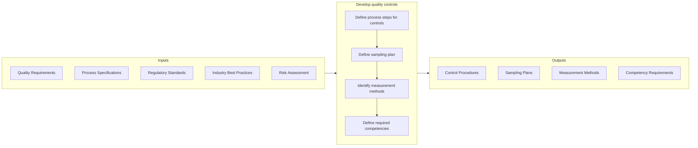

# Develop quality controls

> Developing controls for managing the quality of enterprise.

## Overview

Activity 13.3.1.3 is an activity within the Develop and Manage Business Capabilities framework. This activity establishes the control mechanisms that ensure consistent quality across products, services, and processes.

Quality controls are the checkpoints, procedures, and methods used to verify that outputs meet established standards before proceeding to the next stage or being delivered to customers. Effective quality controls prevent defects, reduce waste, and ensure compliance with both internal standards and external requirements.

Developing quality controls requires understanding the critical quality characteristics, defining appropriate control methods, and establishing the competencies needed to execute controls effectively. This activity creates the operational framework for quality management execution.

## Process Hierarchy


## Key Statistics

| Metric | Value |
|--------|-------|
| APQC Code | 17475 |
| Hierarchy ID | 13.3.1.3 |
| Level | Activity |
| Parent | [13.3.1](../) |
| Sub-Processes | 4 |


## GraphDL Semantic Structure

```graphdl
develop.QualityControls
```

| Component | Value | Description |
|-----------|-------|-------------|
| Verb | `develop` | Primary action |
| Object | `quality controls` | Direct object |


## Process Flow



## Child Processes

### 13.3.1.3.1 Define Process Steps for Controls

Establishing the steps for developing quality controls at critical integration points. This sub-activity identifies where controls should be placed and what actions are required.

**Key Activities:**
- Identify critical control points in processes
- Define control steps and procedures
- Establish integration points with processes
- Document control requirements
- Define escalation procedures

[View Process Details](./DefineProcessStepsForControlsOrIntegrationPoints)

### 13.3.1.3.2 Define Sampling Plan

Establishing a detailed summary including measures, on which material, in what manner, and by whom. This sub-activity creates the statistical basis for quality verification.

**Key Activities:**
- Determine sampling methodology
- Establish sample sizes and frequencies
- Define sampling locations and timing
- Document sampling procedures
- Validate statistical adequacy

[View Process Details](./DefineSamplingPlan)

### 13.3.1.3.3 Identify Measurement Methods

Using tools to measure quality characteristics. This sub-activity selects and defines the measurement approaches for quality verification.

**Key Activities:**
- Select measurement instruments and methods
- Define measurement procedures
- Establish measurement accuracy requirements
- Document measurement specifications
- Plan measurement system analysis

[View Process Details](./IdentifyMeasurementMethods)

### 13.3.1.3.4 Define Required Competencies

Defining the competencies required for developing and executing quality controls. This sub-activity ensures personnel have the skills for effective quality control.

**Key Activities:**
- Identify required quality competencies
- Define training requirements
- Establish certification needs
- Document competency standards
- Plan competency assessment

[View Process Details](./DefineRequiredCompetencies)


## RACI Matrix

| Activity | Responsible | Accountable | Consulted | Informed |
|----------|-------------|-------------|-----------|----------|
| Define control steps | Quality Engineer | Quality Manager | Process Owners | Operations |
| Establish control points | Quality Analyst | Quality Manager | Operations | Manufacturing |
| Define sampling plans | Quality Engineer | Quality Manager | Statistics | Production |
| Select measurement methods | Quality Engineer | Quality Manager | Engineering | Laboratory |
| Define competencies | Quality Manager | Quality Director | HR, Training | Employees |
| Document procedures | Quality Analyst | Quality Manager | Technical Writing | All users |


## Metrics and KPIs

| Metric | Description | Target |
|--------|-------------|--------|
| Control Coverage | Critical points with defined controls | 100% |
| Sampling Adequacy | Statistical adequacy of sampling plans | AQL standards |
| Measurement Accuracy | Measurement system capability (R&R) | <10% GR&R |
| Competency Compliance | Personnel meeting competency requirements | 100% |
| Control Effectiveness | Defect detection rate at control points | >99% |
| Control Efficiency | Resources required for control execution | Optimized |


## Related Departments

- [Quality Assurance](/departments/Quality) - Quality control design
- [Operations](/departments/Operations) - Control implementation
- [Engineering](/departments/Engineering) - Technical specifications
- [Training](/departments/Training) - Competency development
- [Laboratory](/departments/Laboratory) - Measurement capabilities


## Related Occupations

- [Quality Control Analysts](/occupations/Business/QualityControl) - Control design and execution
- [Industrial Engineers](/occupations/Engineering/IndustrialEngineers) - Process control engineering
- [Statisticians](/occupations/Math/Statisticians) - Sampling plan design
- [Calibration Technicians](/occupations/Technical/CalibrationTechnicians) - Measurement systems
- [Training Specialists](/occupations/HR/TrainingSpecialists) - Competency development


## Industry Variations

### Manufacturing

Manufacturing quality controls emphasize statistical process control, incoming/in-process/final inspection, and measurement system analysis. Controls integrate with manufacturing execution systems. ISO/IATF/AS quality standards define requirements.

### Pharmaceutical

Pharmaceutical quality controls require extensive validation, documentation, and regulatory compliance. GMP (Good Manufacturing Practice) requirements drive control design. Sampling plans follow FDA/ICH guidelines.

### Healthcare

Healthcare quality controls address clinical outcomes, patient safety, and service quality. Controls integrate with clinical protocols and electronic health records. Regulatory requirements (CMS, Joint Commission) define standards.


## Control Types

Quality controls may include:

- **Preventive Controls** - Error-proofing to prevent defects
- **Detective Controls** - Inspection to identify defects
- **Corrective Controls** - Actions to address identified issues
- **Monitoring Controls** - Ongoing process surveillance
- **Verification Controls** - Confirmation of compliance


## Sampling Methodologies

- **Acceptance Sampling** - Lot-by-lot inspection decisions
- **Statistical Process Control** - Ongoing process monitoring
- **Random Sampling** - Representative selection
- **Stratified Sampling** - Proportional representation
- **Skip-Lot Sampling** - Reduced sampling for proven quality


---

*Source: APQC PCF 17475 (13.3.1.3) - APQC*
