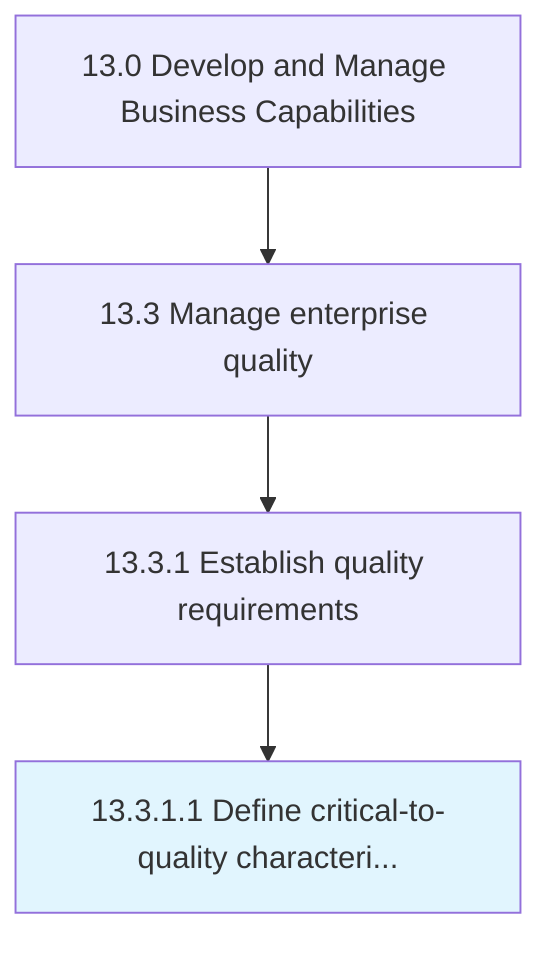

# Define critical-to-quality characteristics

> Outlining characteristics crucial for managing enterprise quality.

## Overview

Activity 13.3.1.1 is an activity within the Develop and Manage Business Capabilities framework. 

Outlining characteristics crucial for managing enterprise quality. Translate broad customer needs into specific, actionable, measurable performance requirements. Define the key measurable characteristics of key products and processes.

## Process Hierarchy



## Key Statistics

| Metric | Value |
|--------|-------|
| APQC Code | 17473 |
| Hierarchy ID | 13.3.1.1 |
| Level | Activity |
| Parent | [13.3.1](../) |
| Sub-Processes | 0 |


## GraphDL Semantic Structure

```
define.CriticaltoqualityCharacteristics
```

| Component | Value | Description |
|-----------|-------|-------------|
| Verb | `define` | Primary action |
| Object | `critical-to-quality characteristics` | Direct object |


---

*Source: APQC PCF 17473 (13.3.1.1) - APQC*
