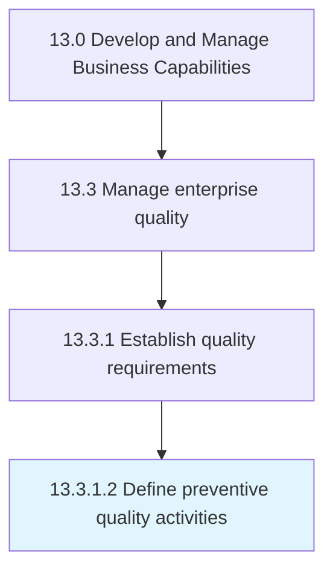

# Define preventive quality activities

> Identifying gaps in customer requirements and determining whether the gap will be mitigated through preventive Quality activities or deemed as acceptable risk.

## Overview

Activity 13.3.1.2 is an activity within the Develop and Manage Business Capabilities framework. 

Identifying gaps in customer requirements and determining whether the gap will be mitigated through preventive Quality activities or deemed as acceptable risk. The goal of any preventive quality activities is to create provisions to prevent, control, or reduce the risk of not meeting the CtQCs. In addition, any standard methodology that will be used to design or conduct preventive Quality activities are defined and documented.

## Process Hierarchy



## Key Statistics

| Metric | Value |
|--------|-------|
| APQC Code | 17474 |
| Hierarchy ID | 13.3.1.2 |
| Level | Activity |
| Parent | [13.3.1](../) |
| Sub-Processes | 0 |


## GraphDL Semantic Structure

```
define.PreventiveQualityActivities
```

| Component | Value | Description |
|-----------|-------|-------------|
| Verb | `define` | Primary action |
| Object | `preventive quality activities` | Direct object |


## Related Concepts

- PreventiveQualityActivities


---

*Source: APQC PCF 17474 (13.3.1.2) - APQC*
