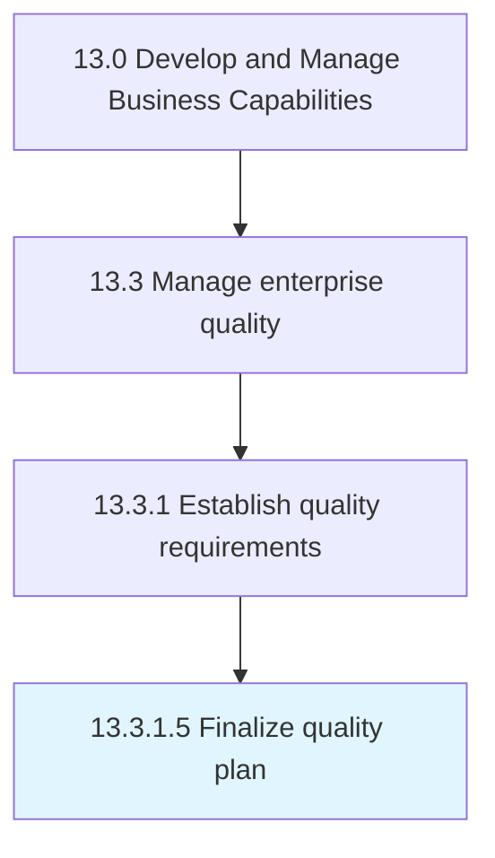

# Finalize quality plan

> Establishing how the critical-to-quality characteristics will be achieved, controlled, ensured, and managed throughout the lifecycle of a product/service.

## Overview

Activity 13.3.1.5 is an activity within the Develop and Manage Business Capabilities framework. 

Establishing how the critical-to-quality characteristics will be achieved, controlled, ensured, and managed throughout the lifecycle of a product/service. Address quality requirements and critical-to-quality characteristics. Conduct a preventive quality assessment. Describe how to verify the product/service, verification criteria, and response to nonconformance. Keep records to demonstrate conformity.

## Process Hierarchy



## Key Statistics

| Metric | Value |
|--------|-------|
| APQC Code | 17481 |
| Hierarchy ID | 13.3.1.5 |
| Level | Activity |
| Parent | [13.3.1](../) |
| Sub-Processes | 0 |


## GraphDL Semantic Structure

```
finalize.QualityPlan
```

| Component | Value | Description |
|-----------|-------|-------------|
| Verb | `finalize` | Primary action |
| Object | `quality plan` | Direct object |


## Related Concepts

- QualityPlan


---

*Source: APQC PCF 17481 (13.3.1.5) - APQC*
