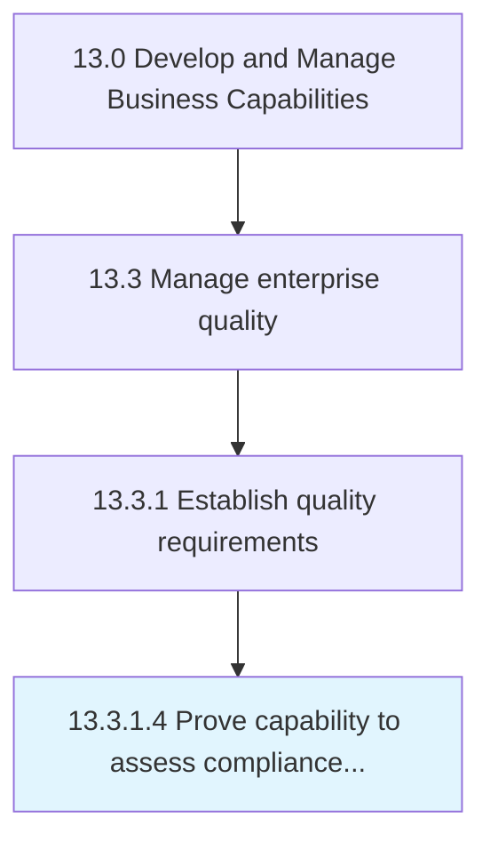

# Prove capability to assess compliance with requirements

> Demonstrating the ability and capability to confirm and fulfill the quality requirements in front of customers, managers, employees, board members, associations, regulatory bodies, and creditors.

## Overview

Activity 13.3.1.4 is an activity within the Develop and Manage Business Capabilities framework. 

Demonstrating the ability and capability to confirm and fulfill the quality requirements in front of customers, managers, employees, board members, associations, regulatory bodies, and creditors. Leverage tools and techniques such as process behavior or control charts, statistical process control, measurement system analysis, gage calibration management, and process capability analysis.

## Process Hierarchy



## Key Statistics

| Metric | Value |
|--------|-------|
| APQC Code | 17480 |
| Hierarchy ID | 13.3.1.4 |
| Level | Activity |
| Parent | [13.3.1](../) |
| Sub-Processes | 0 |


## GraphDL Semantic Structure

```
prove.Capability.to.AssessComplianceWithRequirements
```

| Component | Value | Description |
|-----------|-------|-------------|
| Verb | `prove` | Primary action |
| Object | `capability` | Direct object |
| Preposition | `to` | Relationship |
| PrepObject | `assess compliance with requirements` | Indirect object |


## Related Concepts

- [Capability](/concepts/Capability)
- [AssessComplianceWithRequirements](/concepts/AssessComplianceWithRequirements)


---

*Source: APQC PCF 17480 (13.3.1.4) - APQC*
