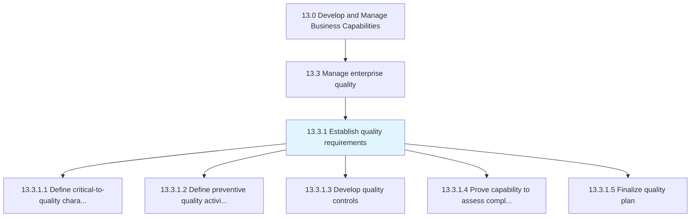
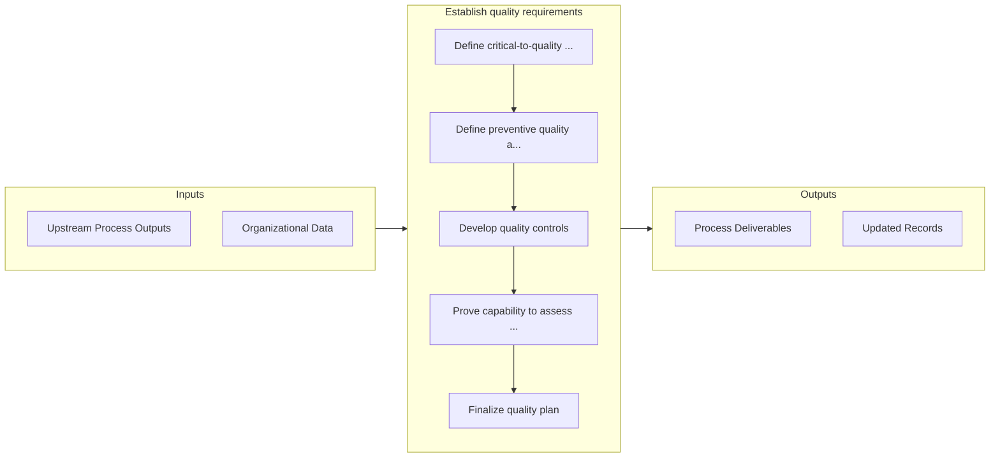

# Establish quality requirements

> Determining essential activities, processes, and attributes for securing enterprise quality.

## Overview

Process 13.3.1 is a core process that defines the specific procedures for establish quality requirements. 

Determining essential activities, processes, and attributes for securing enterprise quality. Outline critical characteristics for quality. Outline activities encouraging the preservation of quality. Create quality controls. Confirm capabilities in accordance with quality requirements. Finalize the plan for quality maintenance.

## Process Hierarchy



## Key Statistics

| Metric | Value |
|--------|-------|
| APQC Code | 17472 |
| Hierarchy ID | 13.3.1 |
| Level | Process |
| Parent | [13.3](../) |
| Sub-Processes | 5 |


## GraphDL Semantic Structure

```graphdl
establish.QualityRequirements
```

| Component | Value | Description |
|-----------|-------|-------------|
| Verb | `establish` | Primary action |
| Object | `quality requirements` | Direct object |


## Process Flow



## Sub-Processes

| Process | Hierarchy ID | Description |
|---------|-------------|-------------|
| [Define critical-to-quality characteristics](./DefineCriticaltoqualityCharacteristics) | 13.3.1.1 | Outlining characteristics crucial for managing enterprise quality |
| [Define preventive quality activities](./DefinePreventiveQualityActivities) | 13.3.1.2 | Identifying gaps in customer requirements and determining whether the gap will be mitigated through  |
| [Develop quality controls](./13.3.1.3-DevelopQualityControls/) | 13.3.1.3 | Developing controls for managing the quality of enterprise |
| [Prove capability to assess compliance with requirements](./ProveCapabilityToAssessComplianceWithRequirements) | 13.3.1.4 | Demonstrating the ability and capability to confirm and fulfill the quality requirements in front of |
| [Finalize quality plan](./FinalizeQualityPlan) | 13.3.1.5 | Establishing how the critical-to-quality characteristics will be achieved, controlled, ensured, and  |


## Related Concepts

- QualityRequirements


---

*Source: APQC PCF 17472 (13.3.1) - APQC*
