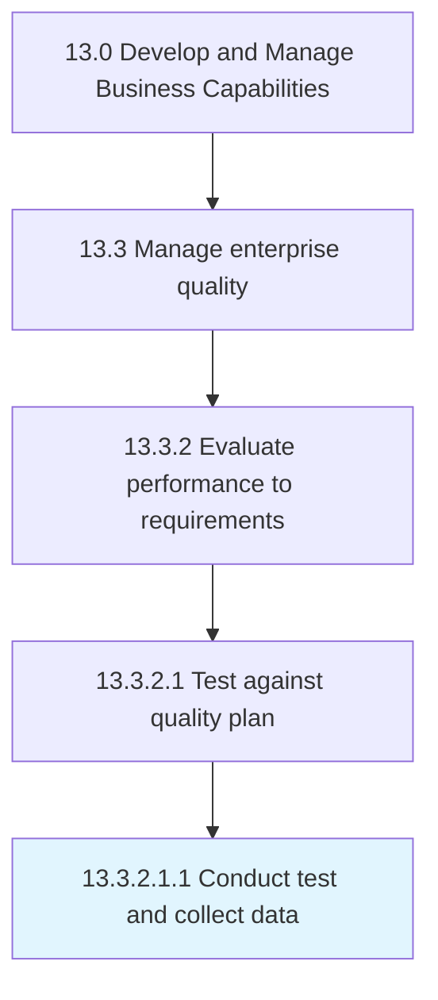

# Conduct test and collect data

> Evaluating quality performance through periodic or episodic testing against the established standards for quality characteristics.

## Overview

Sub-Activity 13.3.2.1.1 is an activity within the Develop and Manage Business Capabilities framework. 

Evaluating quality performance through periodic or episodic testing against the established standards for quality characteristics. For periodic testing, design a schedule with sufficient time to make any required adjustments to the process or system to maintain the desired level of quality. For episodic testing, conduct a test whenever a known non-conformance or fault occurs, which results in outputs or outcomes known to be unsatisfactory to performance requirements.

## Process Hierarchy



## Key Statistics

| Metric | Value |
|--------|-------|
| APQC Code | 17484 |
| Hierarchy ID | 13.3.2.1.1 |
| Level | Sub-Activity |
| Parent | [13.3.2.1](../) |
| Sub-Processes | 0 |


## GraphDL Semantic Structure

```
conduct.TestAndCollectData
```

| Component | Value | Description |
|-----------|-------|-------------|
| Verb | `conduct` | Primary action |
| Object | `test and collect data` | Direct object |


## Related Concepts

- TestData
- CollectData


---

*Source: APQC PCF 17484 (13.3.2.1.1) - APQC*
