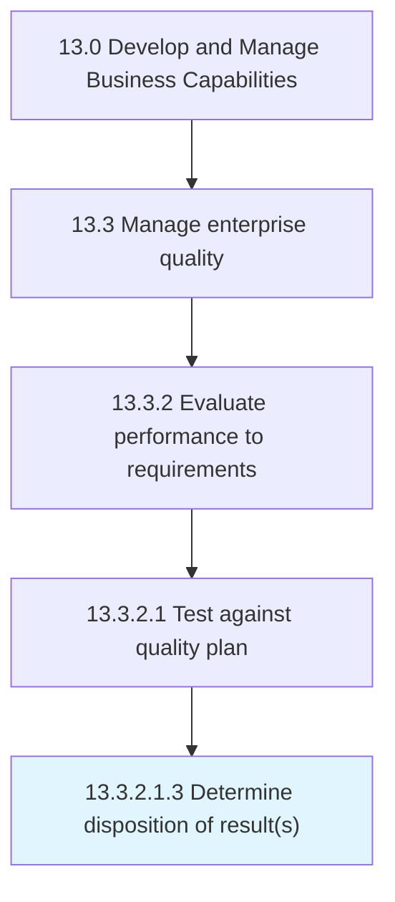

# Determine disposition of result(s)

> Deciding whether to take any additional actions based on the results of quality tests.

## Overview

Sub-Activity 13.3.2.1.3 is an activity within the Develop and Manage Business Capabilities framework. 

Deciding whether to take any additional actions based on the results of quality tests. Initiate a quarantine disposition and relocated inventory, scrap workflow item and scrap transaction, rework operation, net-able and nonnet-able items, and the activity list.

## Process Hierarchy



## Key Statistics

| Metric | Value |
|--------|-------|
| APQC Code | 17486 |
| Hierarchy ID | 13.3.2.1.3 |
| Level | Sub-Activity |
| Parent | [13.3.2.1](../) |
| Sub-Processes | 0 |


## GraphDL Semantic Structure

```
determine.Disposition.of.Results
```

| Component | Value | Description |
|-----------|-------|-------------|
| Verb | `determine` | Primary action |
| Object | `disposition` | Direct object |
| Preposition | `of` | Relationship |
| PrepObject | `result(s)` | Indirect object |


## Related Concepts

- Disposition
- Result(S


---

*Source: APQC PCF 17486 (13.3.2.1.3) - APQC*
