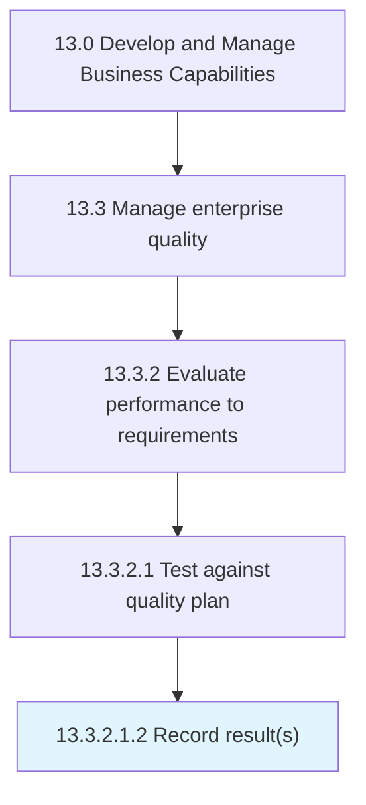

# Record result(s)

> Maintaining and recording the results of Test against the quality plan [17483] electronically and in standard formats.

## Overview

Sub-Activity 13.3.2.1.2 is an activity within the Develop and Manage Business Capabilities framework. 

Maintaining and recording the results of Test against the quality plan [17483] electronically and in standard formats. Assign ownership to a designated function or role.

## Process Hierarchy



## Key Statistics

| Metric | Value |
|--------|-------|
| APQC Code | 17485 |
| Hierarchy ID | 13.3.2.1.2 |
| Level | Sub-Activity |
| Parent | [13.3.2.1](../) |
| Sub-Processes | 0 |


## GraphDL Semantic Structure

```
record.Results
```

| Component | Value | Description |
|-----------|-------|-------------|
| Verb | `record` | Primary action |
| Object | `result(s)` | Direct object |


## Related Concepts

- [Result(S](/concepts/Result(S)


---

*Source: APQC PCF 17485 (13.3.2.1.2) - APQC*
