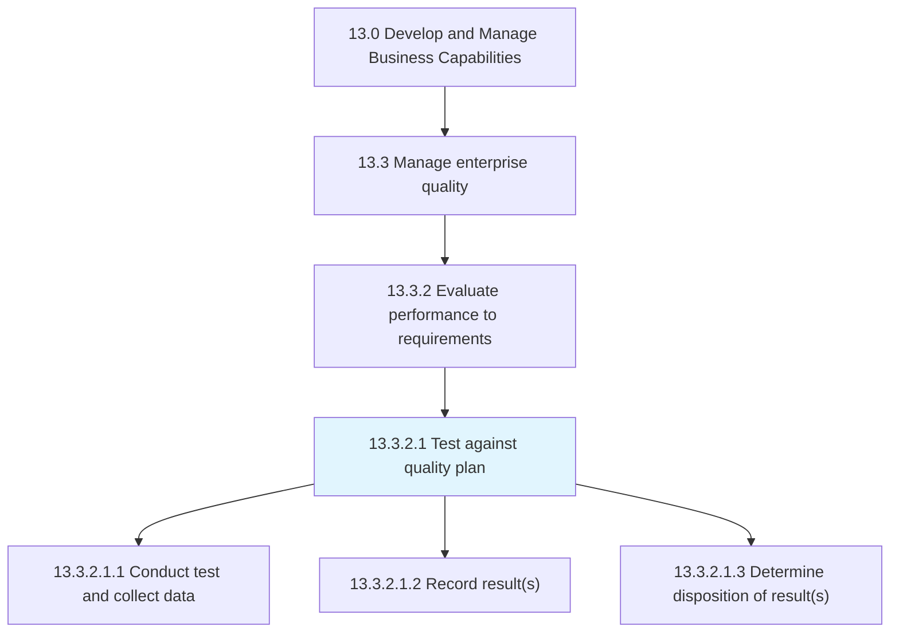
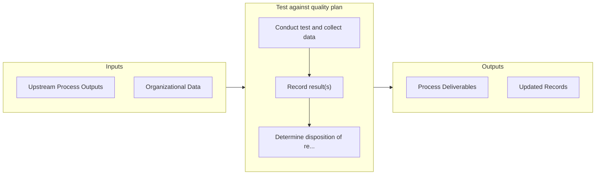

# Test against quality plan

> Examining the quality of organizational processes.

## Overview

Activity 13.3.2.1 is an activity within the Develop and Manage Business Capabilities framework. 

Examining the quality of organizational processes. Conduct tests. Collect information and data. Record the results of these tests. Determine the dispositions of the test results.

## Process Hierarchy



## Key Statistics

| Metric | Value |
|--------|-------|
| APQC Code | 17483 |
| Hierarchy ID | 13.3.2.1 |
| Level | Activity |
| Parent | [13.3.2](../) |
| Sub-Processes | 3 |


## GraphDL Semantic Structure

```
test.AgainstQualityPlan
```

| Component | Value | Description |
|-----------|-------|-------------|
| Verb | `test` | Primary action |
| Object | `against quality plan` | Direct object |


## Process Flow



## Sub-Processes

| Process | Hierarchy ID | Description |
|---------|-------------|-------------|
| [Conduct test and collect data](./ConductTestAndCollectData) | 13.3.2.1.1 | Evaluating quality performance through periodic or episodic testing against the established standard |
| [Record result(s)](./RecordResults) | 13.3.2.1.2 | Maintaining and recording the results of Test against the quality plan [17483] electronically and in |
| [Determine disposition of result(s)](./DetermineDispositionOfResults) | 13.3.2.1.3 | Deciding whether to take any additional actions based on the results of quality tests |


## Related Concepts

- [QualityPlan](/concepts/QualityPlan)


---

*Source: APQC PCF 17483 (13.3.2.1) - APQC*
