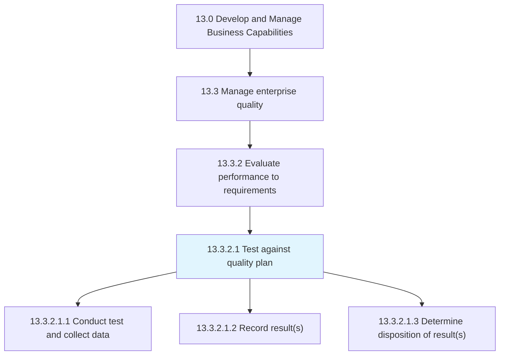
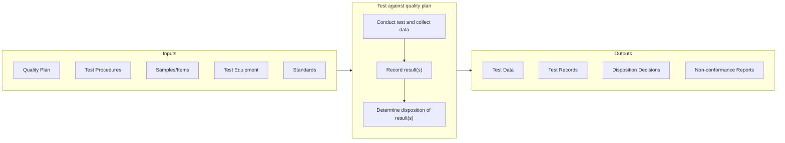

# Test against quality plan

> Examining the quality of organizational processes.

## Overview

Activity 13.3.2.1 is an activity within the Develop and Manage Business Capabilities framework. This activity conducts systematic testing and inspection to verify that processes and outputs conform to established quality standards.

Testing against the quality plan is the execution phase of quality evaluation. It involves conducting tests according to defined procedures, collecting data accurately, recording results properly, and determining appropriate dispositions for tested items. The rigor and consistency of this activity directly impacts the organization's ability to detect and address quality issues.

Effective testing requires well-defined test procedures, accurate measurement systems, trained personnel, and proper documentation. The results of testing feed into assessment activities (13.3.2.2) and may trigger corrective actions when non-conformances are identified.

## Process Hierarchy



## Key Statistics

| Metric | Value |
|--------|-------|
| APQC Code | 17483 |
| Hierarchy ID | 13.3.2.1 |
| Level | Activity |
| Parent | [13.3.2](../) |
| Sub-Processes | 3 |


## GraphDL Semantic Structure

```graphdl
test.AgainstQualityPlan
```

| Component | Value | Description |
|-----------|-------|-------------|
| Verb | `test` | Primary action |
| Object | `against quality plan` | Direct object |


## Process Flow



## Child Processes

### 13.3.2.1.1 Conduct Test and Collect Data

Evaluating quality performance through periodic or episodic testing against established standards. This sub-activity executes tests and captures data according to defined procedures.

**Key Activities:**
- Prepare test equipment and environment
- Execute test procedures as defined
- Collect measurement data
- Document test conditions
- Ensure measurement accuracy

[View Process Details](./ConductTestAndCollectData)

### 13.3.2.1.2 Record Result(s)

Maintaining and recording test results electronically and in appropriate documentation systems. This sub-activity ensures accurate and traceable documentation of test outcomes.

**Key Activities:**
- Record results in quality system
- Document all relevant test details
- Maintain traceability to samples
- Archive records appropriately
- Ensure data integrity

[View Process Details](./RecordResults)

### 13.3.2.1.3 Determine Disposition of Result(s)

Deciding whether to take any additional actions based on the results of quality tests. This sub-activity evaluates test outcomes and determines appropriate responses.

**Key Activities:**
- Compare results to acceptance criteria
- Determine pass/fail status
- Initiate non-conformance reporting when needed
- Decide on material/product disposition
- Escalate as required

[View Process Details](./DetermineDispositionOfResults)


## RACI Matrix

| Activity | Responsible | Accountable | Consulted | Informed |
|----------|-------------|-------------|-----------|----------|
| Conduct tests | Quality Inspector | Quality Manager | Operations | Production |
| Operate test equipment | Quality Technician | Quality Manager | Laboratory | Calibration |
| Collect test data | Quality Inspector | Quality Manager | Process Owners | Management |
| Record results | Quality Inspector | Quality Manager | IT | Stakeholders |
| Determine disposition | Quality Manager | Quality Director | Operations | Production |
| Initiate non-conformances | Quality Inspector | Quality Manager | Production | Management |


## Metrics and KPIs

| Metric | Description | Target |
|--------|-------------|--------|
| Test Completion Rate | Tests completed per schedule | 100% |
| Test Accuracy | Measurement system performance | >95% R&R |
| First Pass Rate | Items passing on first test | >95% |
| Recording Timeliness | Results recorded within SLA | 100% |
| Disposition Accuracy | Correct disposition decisions | 100% |
| Non-conformance Detection | Defects found vs. escaped | >99% |


## Related Departments

- [Quality Assurance](/departments/Quality) - Testing execution
- [Laboratory](/departments/Laboratory) - Testing services
- [Operations](/departments/Operations) - Process testing
- [Production](/departments/Production) - Product testing


## Related Occupations

- [Quality Control Analysts](/occupations/Business/QualityControl) - Testing and inspection
- [Laboratory Technicians](/occupations/Science/LabTechnicians) - Laboratory testing
- [Inspectors, Testers, Sorters](/occupations/Production/Inspectors) - Inspection execution
- [Calibration Technicians](/occupations/Technical/CalibrationTechnicians) - Equipment calibration


## Industry Variations

### Manufacturing

Manufacturing testing includes incoming inspection, in-process inspection, and final inspection. Statistical sampling is common. Measurement system analysis ensures test accuracy.

### Pharmaceutical

Pharmaceutical testing requires validated methods, batch record documentation, and extensive quality control. FDA compliance and GMP requirements drive testing procedures.

### Food and Beverage

Food testing addresses safety (pathogens, contaminants), quality (taste, texture), and labeling compliance. HACCP and food safety programs drive testing requirements.


## Testing Types

- **Inspection** - Visual and dimensional verification
- **Functional Testing** - Performance verification
- **Destructive Testing** - Testing to failure
- **Non-destructive Testing** - Evaluation without damage
- **Environmental Testing** - Performance under conditions


## Disposition Options

When test results are evaluated, typical dispositions include:

- **Accept** - Meets all requirements
- **Reject** - Does not meet requirements
- **Rework** - Can be corrected to meet requirements
- **Concession** - Accept with deviation approval
- **Scrap** - Cannot be used or corrected


---

*Source: APQC PCF 17483 (13.3.2.1) - APQC*
