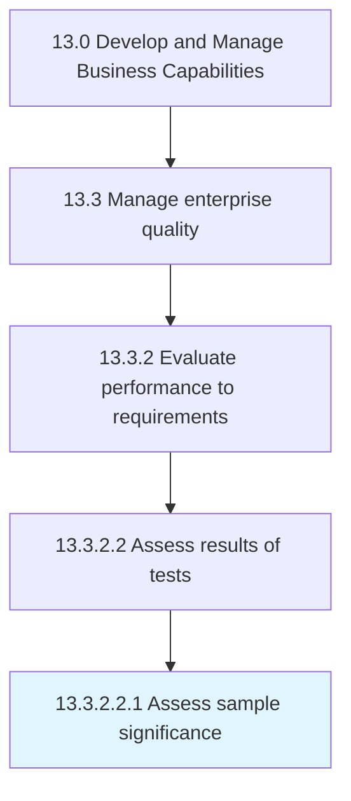

# Assess sample significance

> Assessing the significance of the sample chosen for the test in order to determine whether or not the sample is representative of the larger output or outcome.

## Overview

Sub-Activity 13.3.2.2.1 is an activity within the Develop and Manage Business Capabilities framework. 

Assessing the significance of the sample chosen for the test in order to determine whether or not the sample is representative of the larger output or outcome. Determine if the sample meets or does not meet the requirements. Identify the conditions for acceptance, rejection, remediation, and prevention.

## Process Hierarchy



## Key Statistics

| Metric | Value |
|--------|-------|
| APQC Code | 17488 |
| Hierarchy ID | 13.3.2.2.1 |
| Level | Sub-Activity |
| Parent | [13.3.2.2](../) |
| Sub-Processes | 0 |


## GraphDL Semantic Structure

```
assess.SampleSignificance
```

| Component | Value | Description |
|-----------|-------|-------------|
| Verb | `assess` | Primary action |
| Object | `sample significance` | Direct object |


## Related Concepts

- [SampleSignificance](/concepts/SampleSignificance)


---

*Source: APQC PCF 17488 (13.3.2.2.1) - APQC*
