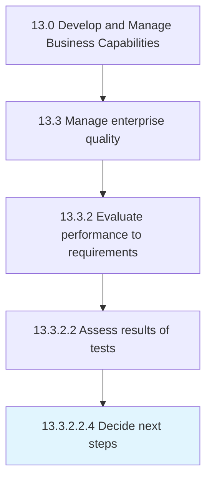

# Decide next steps

> Selecting the subsequent actions that the organization can adopt for improving the enterprise quality.

## Overview

Sub-Activity 13.3.2.2.4 is an activity within the Develop and Manage Business Capabilities framework. 

Selecting the subsequent actions that the organization can adopt for improving the enterprise quality. Select measures and recommended actions for managing the enterprise quality.

## Process Hierarchy



## Key Statistics

| Metric | Value |
|--------|-------|
| APQC Code | 17491 |
| Hierarchy ID | 13.3.2.2.4 |
| Level | Sub-Activity |
| Parent | [13.3.2.2](../) |
| Sub-Processes | 0 |


## GraphDL Semantic Structure

```
decide.NextSteps
```

| Component | Value | Description |
|-----------|-------|-------------|
| Verb | `decide` | Primary action |
| Object | `next steps` | Direct object |


## Related Concepts

- [NextSteps](/concepts/NextSteps)


---

*Source: APQC PCF 17491 (13.3.2.2.4) - APQC*
