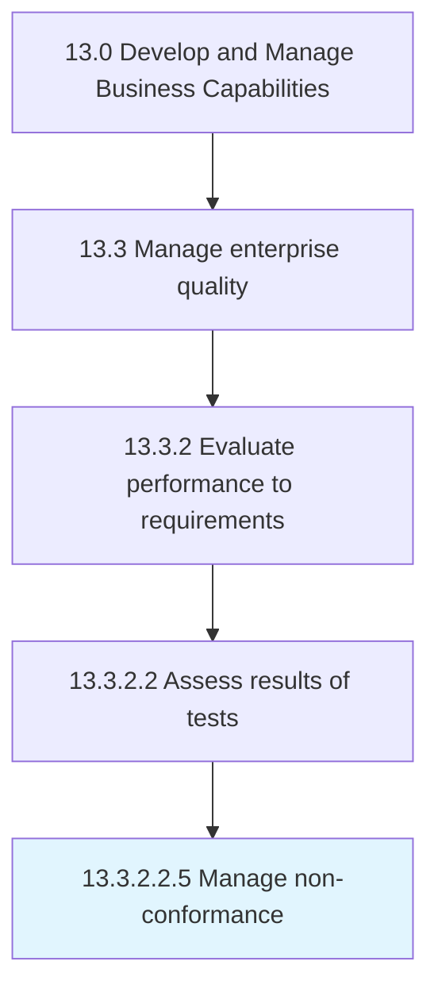

# Manage non-conformance

> Handling any nonconformance activities or events.

## Overview

Sub-Activity 13.3.2.2.5 is an activity within the Develop and Manage Business Capabilities framework. 

Handling any nonconformance activities or events. Assess the potential impact of the nonconformity. Decide the immediate actions to take. Identify the root causes. Take corrective or preventive action. Ensure future conformance.

## Process Hierarchy



## Key Statistics

| Metric | Value |
|--------|-------|
| APQC Code | 17492 |
| Hierarchy ID | 13.3.2.2.5 |
| Level | Sub-Activity |
| Parent | [13.3.2.2](../) |
| Sub-Processes | 0 |


## GraphDL Semantic Structure

```
manage.Nonconformance
```

| Component | Value | Description |
|-----------|-------|-------------|
| Verb | `manage` | Primary action |
| Object | `non-conformance` | Direct object |


---

*Source: APQC PCF 17492 (13.3.2.2.5) - APQC*
