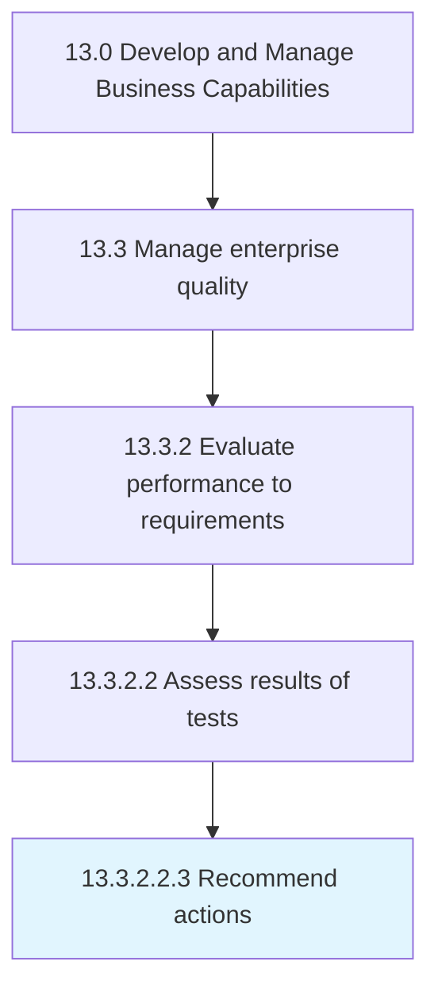

# Recommend actions

> Recommending measures for improvement.

## Overview

Sub-Activity 13.3.2.2.3 is an activity within the Develop and Manage Business Capabilities framework. 

Recommending measures for improvement. Assess the summarized results to identify areas which can be improved. Suggest actions to management for improving the quality plan basis on the results of the tests.

## Process Hierarchy



## Key Statistics

| Metric | Value |
|--------|-------|
| APQC Code | 17490 |
| Hierarchy ID | 13.3.2.2.3 |
| Level | Sub-Activity |
| Parent | [13.3.2.2](../) |
| Sub-Processes | 0 |


## GraphDL Semantic Structure

```
recommend.Actions
```

| Component | Value | Description |
|-----------|-------|-------------|
| Verb | `recommend` | Primary action |
| Object | `actions` | Direct object |


## Related Concepts

- [Actions](/concepts/Actions)


---

*Source: APQC PCF 17490 (13.3.2.2.3) - APQC*
