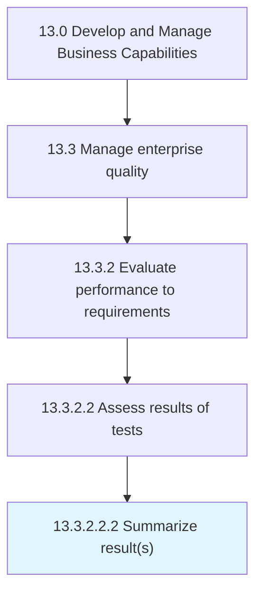

# Summarize result(s)

> Outlining the major facts and figures of the quality test results in order to provide insights and information.

## Overview

Sub-Activity 13.3.2.2.2 is an activity within the Develop and Manage Business Capabilities framework. 

Outlining the major facts and figures of the quality test results in order to provide insights and information. Use charts, tables, statistical test results, and written findings and conclusions in a summary of results.

## Process Hierarchy



## Key Statistics

| Metric | Value |
|--------|-------|
| APQC Code | 17489 |
| Hierarchy ID | 13.3.2.2.2 |
| Level | Sub-Activity |
| Parent | [13.3.2.2](../) |
| Sub-Processes | 0 |


## GraphDL Semantic Structure

```
summarize.Results
```

| Component | Value | Description |
|-----------|-------|-------------|
| Verb | `summarize` | Primary action |
| Object | `result(s)` | Direct object |


## Related Concepts

- [Result(S](/concepts/Result(S)


---

*Source: APQC PCF 17489 (13.3.2.2.2) - APQC*
