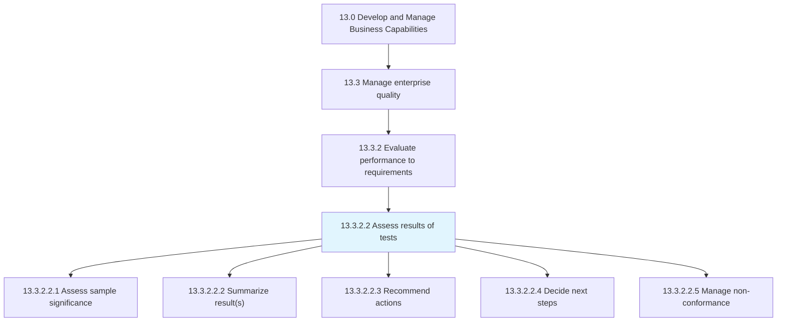
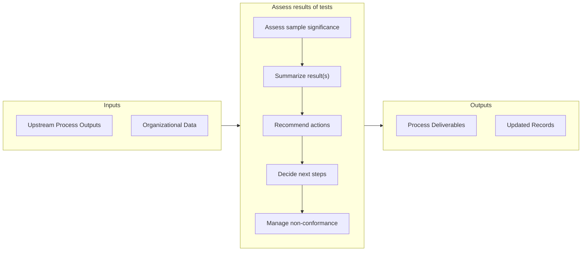

# Assess results of tests

> Assessing the significance of the sample.

## Overview

Activity 13.3.2.2 is an activity within the Develop and Manage Business Capabilities framework. 

Assessing the significance of the sample. Summarize the results of the test. Recommend improvement actions. Decide what steps to take next.

## Process Hierarchy



## Key Statistics

| Metric | Value |
|--------|-------|
| APQC Code | 17487 |
| Hierarchy ID | 13.3.2.2 |
| Level | Activity |
| Parent | [13.3.2](../) |
| Sub-Processes | 5 |


## GraphDL Semantic Structure

```graphdl
assess.Results.of.Tests
```

| Component | Value | Description |
|-----------|-------|-------------|
| Verb | `assess` | Primary action |
| Object | `results` | Direct object |
| Preposition | `of` | Relationship |
| PrepObject | `tests` | Indirect object |


## Process Flow



## Sub-Processes

| Process | Hierarchy ID | Description |
|---------|-------------|-------------|
| [Assess sample significance](./AssessSampleSignificance) | 13.3.2.2.1 | Assessing the significance of the sample chosen for the test in order to determine whether or not th |
| [Summarize result(s)](./SummarizeResults) | 13.3.2.2.2 | Outlining the major facts and figures of the quality test results in order to provide insights and i |
| [Recommend actions](./RecommendActions) | 13.3.2.2.3 | Recommending measures for improvement |
| [Decide next steps](./DecideNextSteps) | 13.3.2.2.4 | Selecting the subsequent actions that the organization can adopt for improving the enterprise qualit |
| [Manage non-conformance](./ManageNonconformance) | 13.3.2.2.5 | Handling any nonconformance activities or events |


## Related Concepts

- Results
- Tests


---

*Source: APQC PCF 17487 (13.3.2.2) - APQC*
