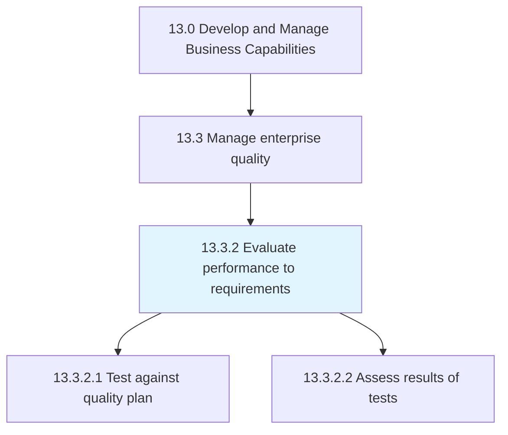
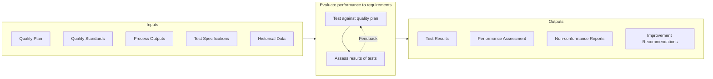

# Evaluate performance to requirements

> Analyzing if the performance of the quality plan has achieved the estimated and desired requirements.

## Overview

Process 13.3.2 is a core process that defines the specific procedures for evaluating performance against quality requirements. This process provides the assessment and validation capabilities needed to verify that quality standards are being met and to identify opportunities for improvement.

Quality performance evaluation is the feedback mechanism that closes the loop between quality planning and quality execution. It compares actual performance against established standards through systematic testing, measurement, and analysis. The insights generated inform both immediate corrective actions and longer-term improvement initiatives.

Effective performance evaluation requires robust testing methodologies, accurate data collection, and rigorous analysis. It must be objective, consistent, and timely to enable proactive quality management rather than reactive problem-solving.

## Process Hierarchy



## Key Statistics

| Metric | Value |
|--------|-------|
| APQC Code | 17482 |
| Hierarchy ID | 13.3.2 |
| Level | Process |
| Parent | [13.3](../) |
| Sub-Processes | 2 |


## GraphDL Semantic Structure

```graphdl
evaluate.Performance.to.Requirements
```

| Component | Value | Description |
|-----------|-------|-------------|
| Verb | `evaluate` | Primary action |
| Object | `performance` | Direct object |
| Preposition | `to` | Relationship |
| PrepObject | `requirements` | Indirect object |


## Process Flow



## Child Processes

### 13.3.2.1 Test Against Quality Plan

Examining the quality of organizational processes through systematic testing. This activity conducts tests, collects data, and records results to verify conformance with quality standards.

**Key Activities:**
- Conduct quality tests and inspections
- Collect quality data per sampling plan
- Record test results accurately
- Determine disposition of results
- Document non-conformances

[View Process Details](./13.3.2.1-TestAgainstQualityPlan/)

### 13.3.2.2 Assess Results of Tests

Assessing the significance of test results and determining appropriate actions. This activity analyzes test data to draw conclusions about quality performance and identify necessary responses.

**Key Activities:**
- Analyze test results and trends
- Compare results to quality standards
- Identify significant variations
- Determine root causes of non-conformances
- Recommend corrective actions

[View Process Details](./13.3.2.2-AssessResultsTests/)


## RACI Matrix

| Activity | Responsible | Accountable | Consulted | Informed |
|----------|-------------|-------------|-----------|----------|
| Conduct quality tests | Quality Inspector | Quality Manager | Operations | Production |
| Collect quality data | Quality Technician | Quality Manager | Process Owners | Management |
| Record test results | Quality Inspector | Quality Manager | IT | Stakeholders |
| Analyze test results | Quality Analyst | Quality Manager | Engineering | Operations |
| Identify non-conformances | Quality Inspector | Quality Manager | Production | Management |
| Determine root causes | Quality Engineer | Quality Manager | Operations | Stakeholders |
| Recommend corrective actions | Quality Analyst | Quality Director | Process Owners | Executive team |


## Metrics and KPIs

| Metric | Description | Target |
|--------|-------------|--------|
| Test Coverage | Percentage of quality points tested | 100% |
| First Pass Yield | Products passing all tests on first attempt | >95% |
| Defect Detection Rate | Defects found before customer delivery | >99% |
| Test Cycle Time | Time to complete quality testing | Within SLA |
| Non-conformance Rate | Frequency of quality failures | Decreasing trend |
| Repeat Non-conformances | Recurring quality issues | <5% |
| Corrective Action Effectiveness | Actions preventing recurrence | >90% |
| Test Accuracy | Measurement system analysis (MSA) | >95% R&R |


## Related Departments

- [Quality Assurance](/departments/Quality) - Quality testing and evaluation
- [Operations](/departments/Operations) - Production quality execution
- [Engineering](/departments/Engineering) - Technical quality standards
- [Laboratory](/departments/Laboratory) - Testing services
- [Compliance](/departments/Compliance) - Regulatory quality requirements


## Related Occupations

- [Quality Control Analysts](/occupations/Business/QualityControl) - Testing and inspection
- [Quality Assurance Specialists](/occupations/Business/QualityAssurance) - Quality evaluation
- [Industrial Engineers](/occupations/Engineering/IndustrialEngineers) - Process quality analysis
- [Laboratory Technicians](/occupations/Science/LabTechnicians) - Laboratory testing
- [Statisticians](/occupations/Math/Statisticians) - Statistical quality analysis


## Industry Variations

### Manufacturing

Manufacturing quality evaluation emphasizes statistical process control, incoming inspection, and final product testing. Measurement systems analysis ensures test accuracy. Industry standards (ISO, IATF, AS) drive testing requirements.

### Healthcare

Healthcare quality evaluation focuses on clinical outcomes, patient safety, and service quality. Testing includes clinical laboratory analysis and equipment validation. Regulatory requirements (CMS, Joint Commission) define evaluation criteria.

### Financial Services

Financial services quality evaluation addresses transaction accuracy, data quality, and service levels. Testing includes control testing and compliance sampling. Regulatory examinations inform evaluation scope.


## Testing Methodologies

Quality evaluation may employ various approaches:

- **Statistical Sampling** - Representative sample testing
- **100% Inspection** - Complete testing of critical characteristics
- **Statistical Process Control** - Ongoing process monitoring
- **Audit Testing** - Periodic compliance verification
- **Customer Feedback Analysis** - Voice of customer assessment


## Quality Evaluation Tools

- **Control Charts** - Process stability monitoring
- **Pareto Analysis** - Problem prioritization
- **Root Cause Analysis** - Failure investigation
- **Measurement System Analysis** - Test accuracy verification
- **Capability Studies** - Process capability assessment


---

*Source: APQC PCF 17482 (13.3.2) - APQC*
