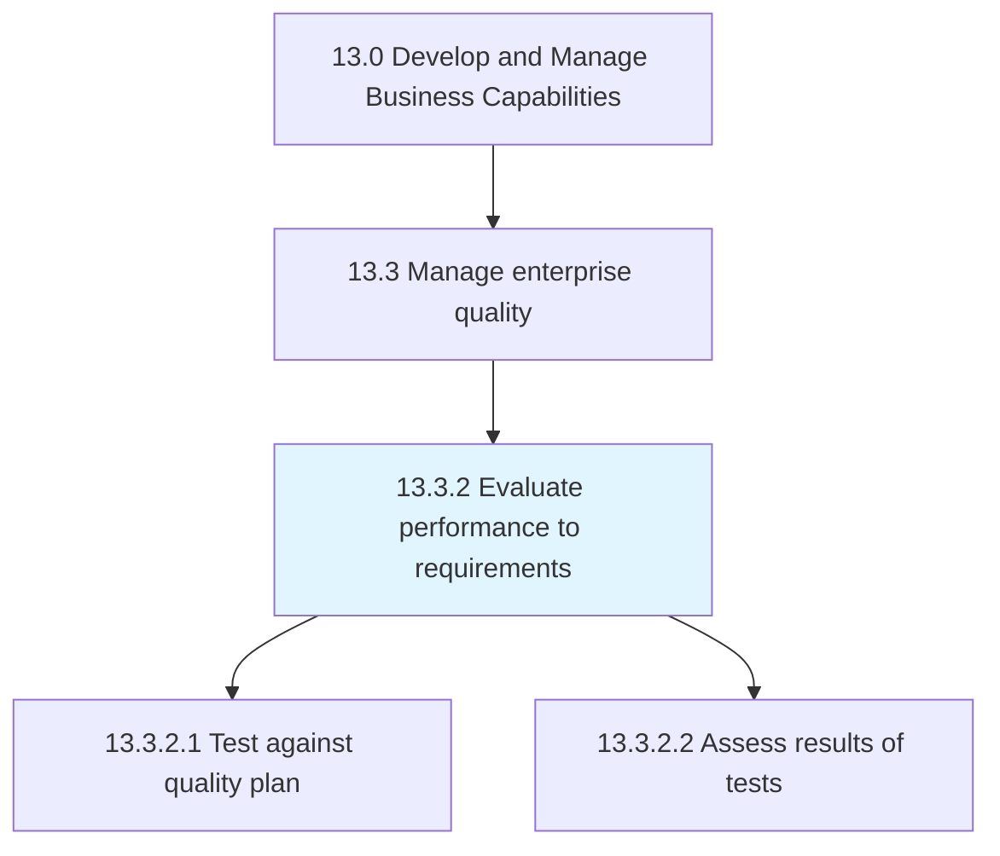
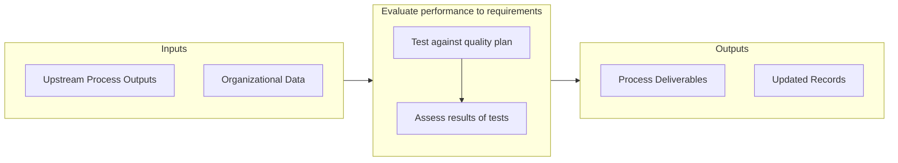

# Evaluate performance to requirements

> Analyzing if the performance of the quality plan has achieved the estimated and desired requirements.

## Overview

Process 13.3.2 is a core process that defines the specific procedures for evaluate performance to requirements. 

Analyzing if the performance of the quality plan has achieved the estimated and desired requirements. Conduct tests against the quality plan. Assess the results of these tests.

## Process Hierarchy



## Key Statistics

| Metric | Value |
|--------|-------|
| APQC Code | 17482 |
| Hierarchy ID | 13.3.2 |
| Level | Process |
| Parent | [13.3](../) |
| Sub-Processes | 2 |


## GraphDL Semantic Structure

```graphdl
evaluate.Performance.to.Requirements
```

| Component | Value | Description |
|-----------|-------|-------------|
| Verb | `evaluate` | Primary action |
| Object | `performance` | Direct object |
| Preposition | `to` | Relationship |
| PrepObject | `requirements` | Indirect object |


## Process Flow



## Sub-Processes

| Process | Hierarchy ID | Description |
|---------|-------------|-------------|
| [Test against quality plan](./13.3.2.1-TestAgainstQualityPlan/) | 13.3.2.1 | Examining the quality of organizational processes |
| [Assess results of tests](./13.3.2.2-AssessResultsTests/) | 13.3.2.2 | Assessing the significance of the sample |


## Related Concepts

- Performance
- Requirements


---

*Source: APQC PCF 17482 (13.3.2) - APQC*
