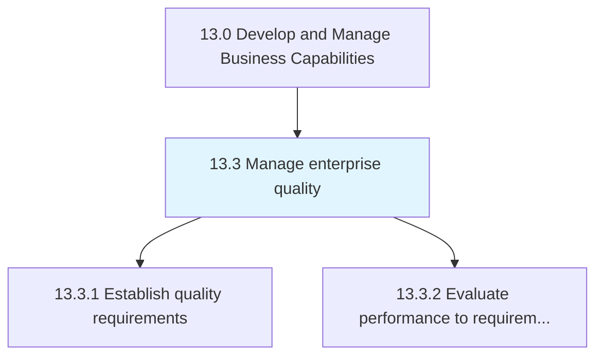
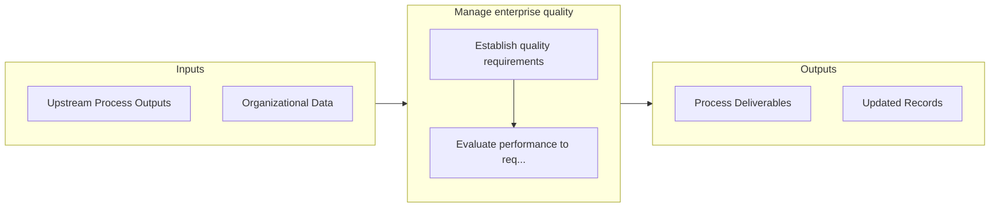

# Manage enterprise quality

> Managing organizational attributes that are closely associated with the quality of output.

## Overview

Group 13.3 is a process group within APQC Category 13.0 (Develop and Manage Business Capabilities). 

Managing organizational attributes that are closely associated with the quality of output. Determine the quality requirements. Evaluate the correspondence between the quality performance and requirements. Manage non-conformance activities. Ensure implementation and maintenance of the enterprise quality management system.

## Process Hierarchy



## Key Statistics

| Metric | Value |
|--------|-------|
| APQC Code | 17471 |
| Hierarchy ID | 13.3 |
| Level | Group |
| Parent | [13](../) |
| Sub-Processes | 2 |


## GraphDL Semantic Structure

```
manage.EnterpriseQuality
```

| Component | Value | Description |
|-----------|-------|-------------|
| Verb | `manage` | Primary action |
| Object | `enterprise quality` | Direct object |


## Process Flow



## Sub-Processes

| Process | Hierarchy ID | Description |
|---------|-------------|-------------|
| [Establish quality requirements](./13.3.1-EstablishQualityRequirements/) | 13.3.1 | Determining essential activities, processes, and attributes for securing enterprise quality |
| [Evaluate performance to requirements](./13.3.2-EvaluatePerformanceRequirements/) | 13.3.2 | Analyzing if the performance of the quality plan has achieved the estimated and desired requirements |


## Related Concepts

- [EnterpriseQuality](/concepts/EnterpriseQuality)


---

*Source: APQC PCF 17471 (13.3) - APQC*
