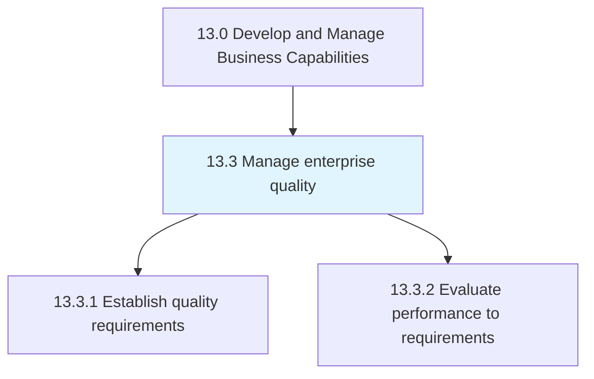
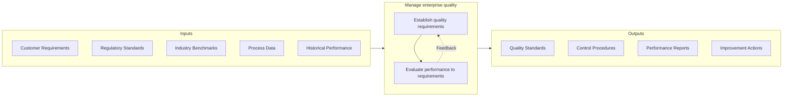
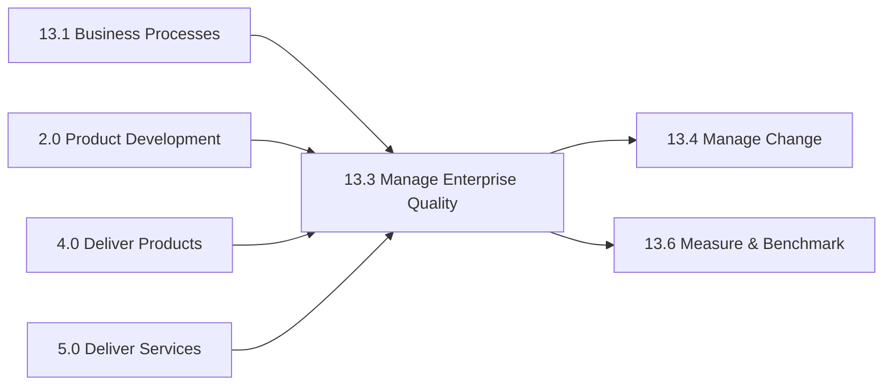

# Manage enterprise quality

> Managing organizational attributes that are closely associated with the quality of output.

## Overview

Group 13.3 is a process group within APQC Category 13.0 (Develop and Manage Business Capabilities) that establishes and maintains the organizational systems, standards, and practices necessary to ensure consistent quality across all business operations. Enterprise quality management is a strategic capability that directly impacts customer satisfaction, operational efficiency, regulatory compliance, and competitive positioning.

This process group encompasses the complete quality management lifecycle, from defining quality requirements and establishing standards, to implementing quality controls, measuring performance against requirements, and driving continuous improvement. It provides the framework for building a quality-centric culture where every employee understands their role in delivering excellence.

Enterprise quality management integrates with all operational processes, serving as both a governance function that sets standards and an enabling function that provides tools, training, and support for quality execution. When effectively implemented, it reduces defects, minimizes waste, enhances customer experience, and creates sustainable competitive advantage.

## Process Hierarchy



## Key Statistics

| Metric | Value |
|--------|-------|
| APQC Code | 17471 |
| Hierarchy ID | 13.3 |
| Level | Group |
| Parent | [13](../) |
| Sub-Processes | 2 |


## GraphDL Semantic Structure

```graphdl
manage.EnterpriseQuality
```

| Component | Value | Description |
|-----------|-------|-------------|
| Verb | `manage` | Primary action |
| Object | `enterprise quality` | Direct object |


## Process Flow



## Child Processes

### 13.3.1 Establish Quality Requirements

Determining essential activities, processes, and attributes for securing enterprise quality. This process creates the foundation for quality management by defining what quality means for the organization and establishing the standards, controls, and competencies required to achieve it.

**Key Activities:**
- Define quality standards and specifications
- Develop quality plan and objectives
- Develop quality controls and inspection criteria
- Establish sampling plans and measurement methods
- Define required competencies for quality roles

[View Process Details](./13.3.1-EstablishQualityRequirements/)

### 13.3.2 Evaluate Performance to Requirements

Analyzing if the performance of the quality plan has achieved the estimated and desired requirements. This process provides the measurement, testing, and assessment capabilities to verify quality outcomes and identify improvement opportunities.

**Key Activities:**
- Conduct tests against quality plan
- Collect and analyze quality data
- Assess results and determine dispositions
- Identify non-conformances and root causes
- Report quality performance to stakeholders

[View Process Details](./13.3.2-EvaluatePerformanceRequirements/)


## RACI Matrix

| Activity | Responsible | Accountable | Consulted | Informed |
|----------|-------------|-------------|-----------|----------|
| Define quality policy | Quality Director | CEO | Executive Team | All employees |
| Establish quality standards | Quality Manager | Quality Director | Operations, Engineering | All departments |
| Develop quality controls | Quality Engineer | Quality Manager | Process Owners | Operations |
| Conduct quality testing | Quality Inspector | Quality Manager | Production | Quality Director |
| Analyze quality data | Quality Analyst | Quality Manager | Process Owners | Management |
| Report quality performance | Quality Manager | Quality Director | Operations | Executive team |
| Manage non-conformances | Quality Engineer | Quality Manager | Affected departments | Regulatory |
| Drive continuous improvement | Process Owners | Quality Director | Quality Team | All employees |


## Metrics and KPIs

| Metric | Description | Target |
|--------|-------------|--------|
| First Pass Yield | Percentage of products/services meeting requirements on first attempt | >95% |
| Defect Rate | Number of defects per unit or transaction | <1% |
| Customer Quality Score | Customer satisfaction with quality | >4.5/5.0 |
| Cost of Quality | Total quality costs as percentage of revenue | <5% |
| Non-Conformance Rate | Frequency of deviations from standards | Decreasing trend |
| Corrective Action Closure | Time to close corrective actions | <30 days |
| Audit Finding Rate | Number of findings per internal/external audit | <5 per audit |
| Supplier Quality Score | Quality performance of key suppliers | >95% |


## Related Departments

- [Quality Assurance](/departments/Quality) - Quality standards, audits, and compliance
- [Operations](/departments/Operations) - Quality execution in production/service delivery
- [Engineering](/departments/Engineering) - Design for quality and technical standards
- [Procurement](/departments/Procurement) - Supplier quality management
- [Customer Service](/departments/CustomerService) - Customer quality feedback and complaints
- [Regulatory Affairs](/departments/Regulatory) - Regulatory compliance requirements


## Related Occupations

- [Quality Control Analysts](/occupations/Business/QualityControl) - Testing and inspection
- [Quality Control Systems Managers](/occupations/Management/QualityManagers) - Quality system leadership
- [Industrial Engineers](/occupations/Engineering/IndustrialEngineers) - Process quality improvement
- [Compliance Officers](/occupations/Business/ComplianceOfficers) - Regulatory quality compliance
- [Management Analysts](/occupations/Business/ManagementAnalysts) - Quality system consulting


## Industry Variations

### Manufacturing

Manufacturing quality management focuses on statistical process control (SPC), Six Sigma methodologies, and lean manufacturing principles. Quality systems often follow ISO 9001, IATF 16949 (automotive), or AS9100 (aerospace) standards with emphasis on supplier quality, incoming inspection, and product traceability.

### Healthcare

Healthcare quality emphasizes patient safety, clinical outcomes, and regulatory compliance. Quality management integrates with patient safety programs, follows Joint Commission standards, and requires robust documentation for quality events. Continuous improvement often uses Lean Healthcare and PDSA cycles.

### Financial Services

Financial services quality focuses on transaction accuracy, data quality, and regulatory compliance. Quality management addresses operational risk, error rates, and customer experience metrics. SOX compliance and internal controls are integral to quality programs.

### Technology

Technology quality management emphasizes software quality assurance, agile testing practices, and continuous integration/deployment. Quality metrics include code coverage, defect density, and user experience scores. DevOps practices integrate quality throughout the development lifecycle.


## Quality Management Frameworks

The organization may adopt one or more established frameworks:

- **ISO 9001** - International quality management system standard
- **Six Sigma** - Data-driven methodology for eliminating defects
- **Lean** - Waste reduction and value stream optimization
- **Total Quality Management (TQM)** - Organization-wide quality culture
- **Baldrige Excellence Framework** - Comprehensive organizational excellence model


## Related Processes



---

*Source: APQC PCF 17471 (13.3) - APQC*
