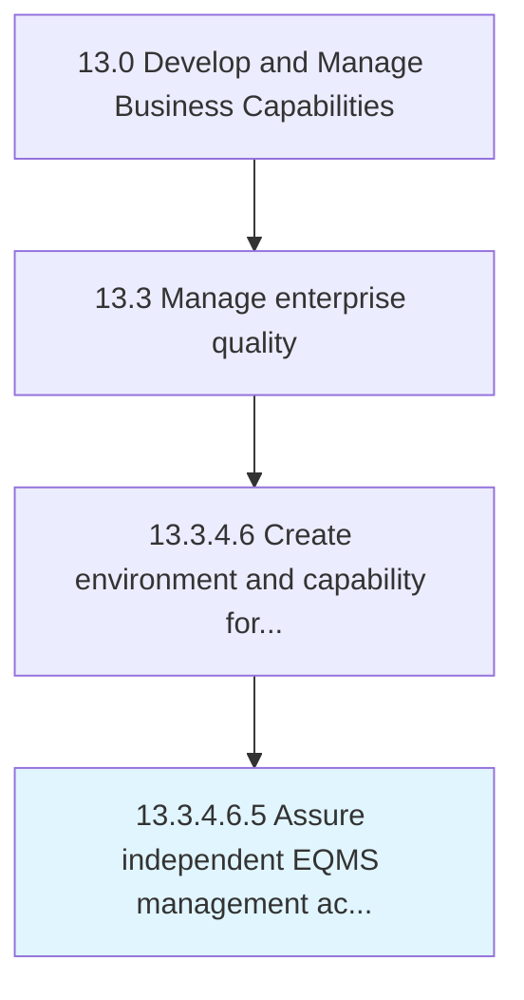

# Assure independent EQMS management access to appropriate authority in the organization

> Ensuring EQMS access to the person in charge of the quality management process.

## Overview

Sub-Activity 13.3.4.6.5 is an activity within the Develop and Manage Business Capabilities framework. 

Ensuring EQMS access to the person in charge of the quality management process. Establish who has the authority to manage the EQMS. Ensure access of EQMS to only the person(s) in authority.

## Process Hierarchy



## Key Statistics

| Metric | Value |
|--------|-------|
| APQC Code | 17509 |
| Hierarchy ID | 13.3.4.6.5 |
| Level | Sub-Activity |
| Parent | [13.3.4.6](../) |
| Sub-Processes | 0 |


## GraphDL Semantic Structure

```
assure.IndependentEQMSManagementAccess.to.AppropriateAuthorityInTheOrganization
```

| Component | Value | Description |
|-----------|-------|-------------|
| Verb | `assure` | Primary action |
| Object | `independent EQMS management access` | Direct object |
| Preposition | `to` | Relationship |
| PrepObject | `appropriate authority in the organization` | Indirect object |


## Related Concepts

- IndependentEQMSManagementAccess
- AppropriateAuthorityInOrganization


---

*Source: APQC PCF 17509 (13.3.4.6.5) - APQC*
