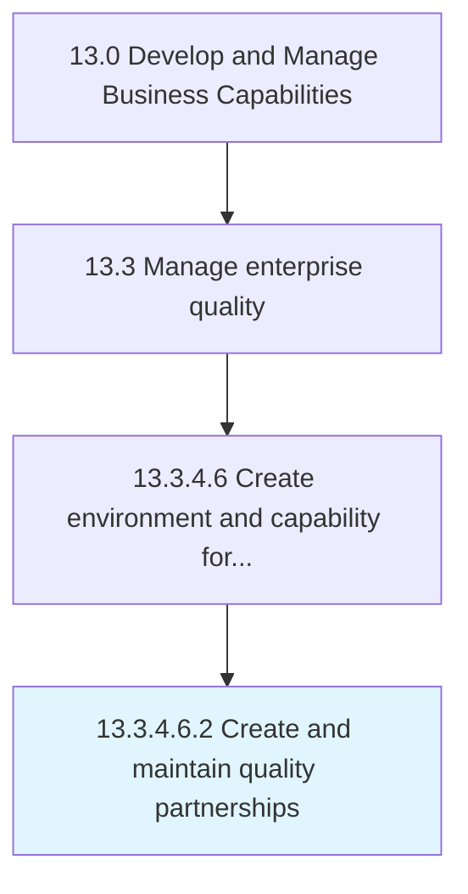

# Create and maintain quality partnerships

> Establishing and maintaining partnerships with third-party sources to achieve quality excellence.

## Overview

Sub-Activity 13.3.4.6.2 is an activity within the Develop and Manage Business Capabilities framework. 

Establishing and maintaining partnerships with third-party sources to achieve quality excellence. Source and evaluate third-party sources both public and private to ensure that the most effective and efficient partnerships are formed.

## Process Hierarchy



## Key Statistics

| Metric | Value |
|--------|-------|
| APQC Code | 17506 |
| Hierarchy ID | 13.3.4.6.2 |
| Level | Sub-Activity |
| Parent | [13.3.4.6](../) |
| Sub-Processes | 0 |


## GraphDL Semantic Structure

```
create.AndMaintainQualityPartnerships
```

| Component | Value | Description |
|-----------|-------|-------------|
| Verb | `create` | Primary action |
| Object | `and maintain quality partnerships` | Direct object |


## Related Concepts

- QualityPartnerships
- QualityPartnerships


---

*Source: APQC PCF 17506 (13.3.4.6.2) - APQC*
