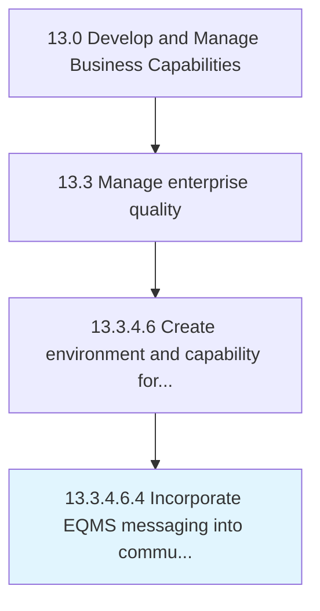

# Incorporate EQMS messaging into communication channels

> Assimilating all the communication related to the EQMS into the organization's already established communication channels.

## Overview

Sub-Activity 13.3.4.6.4 is an activity within the Develop and Manage Business Capabilities framework. 

Assimilating all the communication related to the EQMS into the organization's already established communication channels.

## Process Hierarchy



## Key Statistics

| Metric | Value |
|--------|-------|
| APQC Code | 17508 |
| Hierarchy ID | 13.3.4.6.4 |
| Level | Sub-Activity |
| Parent | [13.3.4.6](../) |
| Sub-Processes | 0 |


## GraphDL Semantic Structure

```
incorporate.EQMSMessaging.into.CommunicationChannels
```

| Component | Value | Description |
|-----------|-------|-------------|
| Verb | `incorporate` | Primary action |
| Object | `EQMS messaging` | Direct object |
| Preposition | `into` | Relationship |
| PrepObject | `communication channels` | Indirect object |


## Related Concepts

- [EQMSMessaging](/concepts/EQMSMessaging)
- [CommunicationChannels](/concepts/CommunicationChannels)


---

*Source: APQC PCF 17508 (13.3.4.6.4) - APQC*
